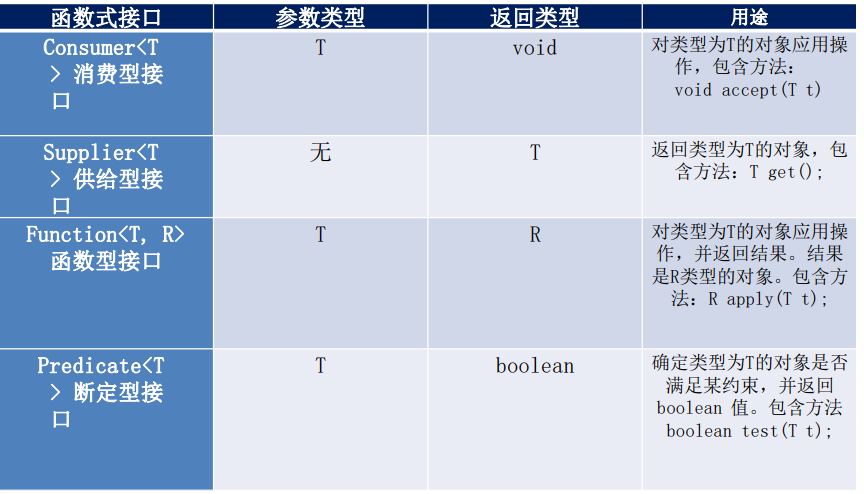

# Java 8 新特性

#### Java 8 新特性简介

速度更快

代码更少（增加了新的语法**Lambda** 表达式）

强大的 **Stream API**

便于并行

最大化减少空指针异常 **Optional**

#### Lambda 表达式

##### 介绍

Lambda 是一个**匿名函数**，我们可以把Lambda 表达式理解为是**一段可以传递的代码**（将代码像数据一样进行传递）。可以写出更简洁、更灵活的代码。作为一种更紧凑的代码风格，使Java 的语言表达能力得到了提升

##### 从匿名类到 Lambda 的转换

```java
//匿名内部类
Runnable r1 = new Runnable(){
	@Override
    public void run(){
        System.out.println("Hello World1");
    }
}

//Lambda 表达式
Runnable r1 = ()-> System.out.println("Hello Lambda");

//原来使用匿名内部类作为参数传递
TreeSet<String> ts = new TreeSet<>(new Comparator<String>(){
    @Override
    public int compare(String o1,String o2){
        return Integer.compare(01.length(),o2.length());
    }
})
    
// Lambda 表达式作为参数传递
TreeSet<String> ts2 = new TreeSet<>(
	(o1,o2) ->Integer.compare(01.length(),o2.length())
)
```

##### Lambda 表达式语法

Lambda 表达式在Java 语言中引入了一个新的语法元素和操作符。这个操作符为“->”，该操作符被称为Lambda 操作符或箭头操作符。它将Lambda 分为两个部分：

左侧：指定了Lambda 表达式需要的所有参数

右侧：指定了Lambda 体，即Lambda 表达式要执行的功能


**语法格式一**：无参，无返回值，Lambda 体只需要一条语句

```java
Runnable r1 = ()-> System.out.println("Hello Lambda");
```


**语法格式二**：Lambda 需要一个参数

```java
Consumer<String> fun = (args)-> System.out.println(args);
```


**语法格式三**：Lambda 只需要一个参数时，参数的小括号可以省略

```java
Consumer<String> fun = args-> System.out.println(args);
```


**语法格式四**：Lambda 需要两个参数，并且有返回值

```java
BinaryOperator<Long> bo = (x,y)->{
    System.out.println("实现函数接口方法");
    return x + y;
}
```

**语法格式五**：当Lambda 体只有**一条**语句时，**return与大括号**可以省略

```java
BinaryOperator<Long> bo = (x,y)-> x + y;
```


**语法格式六**：数据类型可以省略，因为可由编译器推断得出，称为‘类型判断’（语法格式四与六比较）

```java
BinaryOperator<Long> bo = (Long x,Long y)->{
    System.out.println("实现函数接口方法");
    return x + y;
}
```

##### 类型推断

上述Lambda表达式中的参数类型都是由编译器推断得出的。Lambda 表达式中无需指定类型，程序依然可以编译，这是因为javac 根据程序的上下文，在后台推断出了参数的类型。Lambda 表达式的类型依赖于上下文环境，是由编译器推断出来的。这就是所谓的“类型推断”

#### 函数式接口

##### 介绍

只包含一个抽象方法的接口，称为**函数式接口**

可以通过Lambda 表达式来创建该接口对象。（若Lambda 表达式抛出一个受检异常，那么该异常需要在目标接口的抽象方法上进行声明）

我们可以在任意函数式接口，上使用**@FunctionalInterface** 注解，这样做可以检查它是否是一一个函数式接口，同时javadoc 也会包含一条声明，说明这个接口是一个函数式接口。

##### 自定义函数式接口

```java
@FunctionalInterface
public interface MyNumber{
    public double getValue();
}

//函数式接口中使用泛型
@FunctionalInterface
public interface MyFunc<T>{
    public T getValue(T t);
}
```

##### 作为参数传递Lambda 表达式

```java
public String toUpperString(MyFunc<String> mf,String str){
    return mf.getValue(str)
}

//作为参数传递Lambda 表达式
String newStr = toUpperString((str)-> str.toUpperCase(),"abcdef");
System.out.println(newStr);
```

##### Java 内置四大核心函数式接口




#### 方法引用与构造器引用

##### 方法引用

当要传递给Lambda体的操作，已经有实现的方法了，可以使用方法引用!(实现抽象方法的参数列表，必须与方法引用方法的参数列表保持一致! )

方法引用：使用操作符“::” 将方法 名和对象或类的名字分隔开来。

如下三种主要使用情况:

●对象::实例方法

●类::静态方法

●类::实例方法

```java
//例如
(x) ->System.out.println(x);
//等同于
System.out::println
//例如
compare((x,y) -> x.equals(y),"abcdef","abcdef");
//等同于
compare(String::equals,"abcdef","abcdef");
```

**注意**：当需要引用方法的第一个参数是调用对象，并且第二个参数是需要引用方法的第二个参数(或无参数)时：ClassName: :methodName