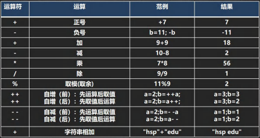
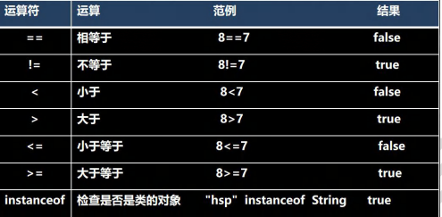
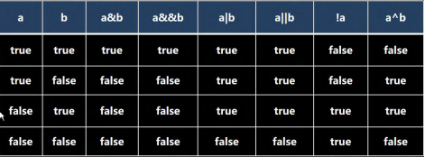
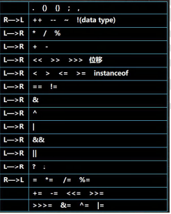
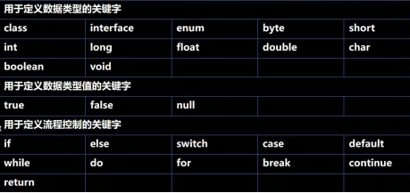
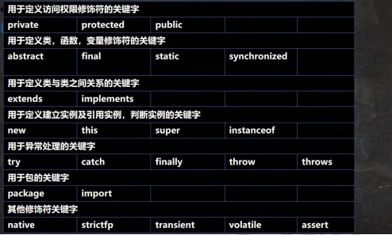
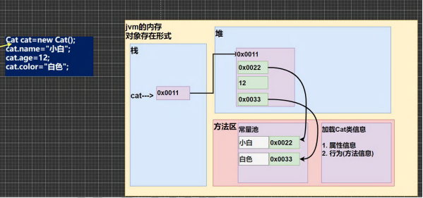
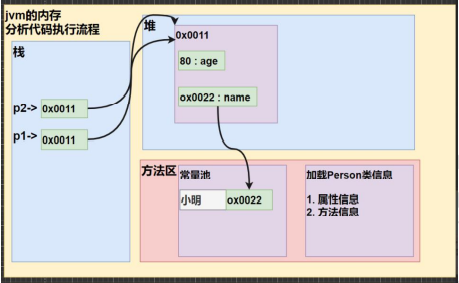
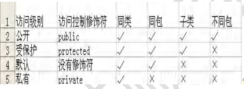

# 第一章 Java概述

#### 1.1 程序

程序：计算机执行某些操作或解决某个问题而编写的一系列有序指令的集合

#### 1.2 Java 历史

1992 创建oak (橡树)语言->java
1994 gosling参加硅谷大会演示java功能,震惊世界。
1995 sun正式发布java第1个版本。
2009年，甲骨文公司宣布收购Sun。2011,发布java7
其它java版本发布详情https://www.oracle.com/java/technologies/java-se-support-roadmap.html

#### 1.3 Java技术体系平台

**Java SE(Java Standard Edition)标准版**

支持面向桌面级应用(如Windows 下的应用程序)的Java平台，提供了完整的Java核心API,此版本以前称为J2SE

**Java EE(Java Enterprise Edition)企业版**

是为开发企业环境下的应用程序提供的一套解决方案。该技术体系中包含的技术如:ServletJsp等，主要针对于Web应用程序开发。版本以前称为J2EE

**Java ME(Java Micro Edition)小型版**

支持Java程序运行在移动终端(手机、PDA). 上的平台， 对Java API有所精简，并加入了针对移动终端的支持，此版本以前称为J2ME

#### 1.4 Java 重要特点

1. Java 语言是面向对象的(oop) 

2. Java 语言是健壮的。Java 的强类型机制、异常处理、垃圾的自动收集等是 Java 程序健壮性的重要保证 

3. Java 语言是**跨平台性**的。[即: 一个编译好的.class 文件可以在多个系统下运行，这种特性称为跨平台]

   

4. Java 语言是解释型的[了解] 

   解释性语言：javascript,PHP, java 

   编译性语言: c / c++ 

   区别是：解释性语言，编译后的代码，不能直接被机器执行,需要解释器来执行, 编译性语言, 编译后的代码, 可 以直接被机器执行, c /c+

#### 1.5 Java 运行机制及运行过程

##### 1.5.1 跨平台性


##### 1.5.2 核心机制 JVM

1) JVM 是一个虚拟的计算机，具有指令集并使用不同的存储区域。负责执行指令，管理数据、内存、寄存器，包含在 JDK 中。
2) 对于不同的平台，有不同的虚拟机。 
3) Java 虚拟机机制屏蔽了底层运行平台的差别，实现了“一次编译，到处运行” [说明]


#### 1.6 什么是 JDK，JRE 

##### 1.6.1 JDK 基本介绍 

1. JDK 的全称(Java Development Kit Java 开发工具包) JDK = JRE + java 的开发工具 [java, javac,javadoc,javap 等]

2. JDK 是提供给 Java 开发人员使用的，其中包含了 java 的开发工具，也包括了 JRE。所以安装了 JDK，就不用在单独 安装 JRE 了。 

##### 1.6.2 JRE 基本介绍 

1) JRE(Java Runtime Environment Java 运行环境) JRE = JVM + Java 的核心类库[类] 

2. 包括 Java 虚拟机(JVM Java Virtual Machine)和 Java 程序所需的核心类库等，如果想要运行一个开发好的 Java 程序， 计算机中只需要安装 JRE 即可。 

##### 1.6.3 JDK、JRE 和 JVM 的包含关系 

1) JDK = JRE + 开发工具集（例如 Javac,java 编译工具等) 
2) JRE = JVM + Java SE 标准类库（java 核心类库） 
3) 如果只想运行开发好的 .class 文件 只需要 JRE

#### 1.7 Java 开发注意事项和细节

1. Java源文件以java为扩展名。源文件的基本组成部分是类(class) ，如本类中的Hello类。

2. Java应用程序的执行入口是main(方法。 它有固定的书写格式:

  `public static void main(String[] args) {..}`

3. Java语言严格区分大小写。

4. Java方法由一条条语句构成，每个语句以","结束。

5. 大括号都是成对出现的，缺一不可。[习惯， 先写{}再写代码]

6. 一个源文件中最多只能有一个public类。其它类的个数不限。[演示]

7. 如果源文件包含一个public类， 则文件名必须按该类名命名! [演示]

8. 一个源文件中最多只能有一个public类。 其它类的个数不限，也可以将main方法写在非public类中，然后指定运行非public类，这样入口方法就是非public 的main方法


#### 1.8 注释

1) 单行注释 // 
2) 多行注释 /* */ 
3) 文档注释 /** */

#### 1.9 DOS命令（了解）

##### 1.9.1 DOS介绍

Dos： Disk Operating System 磁盘操作系统。

##### 1.9.2 相对路径、绝对路径


##### 1.9.3 常用DOS命令

1、查看当前目录内容 dir

dir d:\abc2\test200

2、切换到其他盘下	盘符号 cd :chang directory

cd /D c:

3、切换到当前盘的其他目录下 (使用相对路径和绝对路径演示), ..\表示上一级目录 

cd d:\abc2\test200 

4、切换到上一级

 cd ..

5、切换到根目录

cd \

6、查看指定的目录下所有的子级目录

tree

7、清屏 cls

8、退出 DOS exit

# 第二章 变量

#### 2.1 变量

##### 2.1.1概念

​	**变量相当于内存中一个数据存储空间**的表示，你可以把变量看做是一个房间的**门牌号**，通过门牌号我们可以找到房 间，而通过变量名可以访问到变量(值)。

##### 2.1.2 使用变量

```java
//1) 声明变量
	int a;
//2) 赋值
	a = 60;
	System.out.println(a);
```

#### 2.2 变量使用注意事项

1、变量表示内存中的一个存储区域 [不同的变量，类型不同，占用的空间大小不同，比如：int 4个字节，double 8个字节]

2、该区域有自己的名称[变量名]和类型[数据类型]

3、 变量必须先声明，后使用

4、该区域的数据/值可以在**同一类型**范围内不断变化

5、变量在同一个作用域内不能重名

6、变量 = 变量名 + 值 + 数据类型（**变量三要素**）

#### 2.3 程序中 + 号的使用

1、当左右两边都是数值型时，则做加法运算

2、当左右两边有一方为字符串，则做拼接运算

3、运算顺序，从左到右

#### 2.4 数据类型

​	每一种数据都定义了明确的数据类型，在内存中分配了不同大小的内存空间（字节）


#### 2.5 整数类型

##### 2.5.1 基本介绍

​	Java的整数类型就是用于存放整数值的，比如 12，30，3456 等等

##### 2.5.2 整数的类型

| 类型  | 占用存储空间 | 范围                                        |
| ----- | ------------ | ------------------------------------------- |
| byte  | 1字节        | -128 ~ 127                                  |
| short | 2字节        | -2^15~ 2^15 <br/>-32768 ~ 32767             |
| int   | 4字节        | -2^31 ~ 2^31-1<br/>-2147483648 ~ 2147483647 |
| long  | 8字节        | -2^63 ~ 2^63-1                              |

##### 2.5.3 整型的使用细节

1、Java各整数类型有固定的范围和字段长度，不受具体操作系统的影响，以保证Java程序的可移植性

2、Java的整型常量（具体值）默认为int型，声明long型常量必须后加 'l' 或 'L'

3、Java程序中变量常声明为int型，除非不足以表示大数，才使用long

4、bit: 计算机中的最小存储单位。byte: 计算机中基本存储单元，1byte = 8 bit

#### 2.6 浮点类型

##### 	2.6.1 基本介绍

​		Java 的浮点类型可以表示一个小数，比如 123.4，7.8，0.12 等等

##### 	2.6.2 浮点数的类型

| 类型         | 占用存储空间 | 范围                   |
| ------------ | ------------ | ---------------------- |
| 单精度float  | 4字节        | -3.403E38 ~ 3.403E38   |
| 双精度double | 8字节        | -1.798E308 ~ 1.798E308 |

##### 2.6.3 注意

​	1、关于浮点数在机器中存放形式的简单说明，浮点数 = 符号位 + 指数位 + 尾数位

​	2、尾数部分可能丢失，造成精度损失（小数都是近似值）

##### 2.6.4 浮点数的使用细节

​	1、与整数类型类似，Java浮点类型也有固定的范围和字段长度，不受具体OS的影响。[float 4个字节，double 8个字节]

​	2、Java 的浮点型常量（具体值）默认为double类型，声明float型常量，须后加 'f' 或 'F'

​	3、浮点型常量有两种表示形式

​		十进制数形式 ：5.12  	512.0f		.512（必须有小数点）

​		科学计数法形式 ：5.12E2	5.12E-2

​	4、通常情况下，应该使用double型，因为它比float型更精确

​	5、浮点数使用陷阱： 2.7 和 8.1/3比较

#### 2.7 字符类型

##### 	2.7.1 基本介绍

​	字符类型可以表示单个字符，字符类型是char，char 是两个字节（可以存放汉字），多个字符我们使用字符串String。

##### 	2.7.2 字符类型的使用细节

​	1、字符常量是用单引号（‘ ’）括起来的单个字符

​	2、Java中还允许使用转义字符 '\\' 来将其后的字符转变为特殊字符型常量

​	3、在Java中，char的本质是一个整数，在输出时，是Unicode码对应的字符

​	4、可以直接给char赋一个整数，然后输出时，会按照对应的Unicode字符输出

​	5、char类型是可以进行运算的，相等于一个整数，因为它都对应有Unicode码

#### 2.8 布尔类型

##### 	2.8.1 基本介绍

​	1、布尔类型也叫boolean类型，boolean类型数据只允许取值true和false，无null

​	2、boolean类型占1个字节

​	3、boolean类型适于逻辑运算，一般用于程序流程控制

#### 2.9 基本数据类型转换

##### 	2.9.1 自动类型转换

​	

##### 2.9.2 自动类型转换注意和细节

​	1、有多种类型的数据混合运算时，系统首先自动将所有数据转换成容量最大的那种数据类型，然后再进行计算

​	2、当我们把精度(容量)大的数据类型赋值给精度(容量)小的数据类型时，就会报错，反之就会进行自动类型转换

​	3、(byte,short)和char之间不会相互自动转换

​	4、**byte、short、char 他们三者可以计算，在计算时首先转换为int类型**

​	5、boolean 不参与转换

​	6、自动提升原则：表达式结果的类型自动提升为操作数中最大的类型

#### 2.10 强制类型转换

##### 	2.10.1 介绍

​	自动类型转换的逆过程，**将容量大的数据类型转换为容量小的数据类型**。使用时要加上强制转换符()，但可能造成**精度降低或溢出**，格外要注意。

##### 	2.10.2 强制类型转换细节说明

​	1、当进行数据的大小从 大——>小，就需要使用到强制转换

​	2、强转符号只针对最近的操作数有效，往往会使用小括号提升优先级

```java
//int x = (int)10*3.5+6*1.5; 错误
int y = (int)(10*3.5+6*1.5);
System.out.println(y);
```

​	3、char类型可以保存int的常量值，但不能保存int的变量值，需要强转

```java
char c1 = 100; //ok
int m = 100; //ok
char c2 = m; //错误
char c3 = (char)m; //ok
```

4、byte和short，char类型在进行 运算时，当做int类型处理。

#### 2.11 基本数据类型和String类型的转换

##### 	2.11.1 使用

​	基本类型转String类型语法：

​		将基本类型的值 + "" 即可

​	String类型转基本数据类型语法：

​		通过基本类型的包装类调用parseXX方法即可

# 第三章 运算符

#### 	3.1 运算符介绍

##### 		3.1.1 运算符介绍

​		运算符是一种特殊的符号，用以表示数据的运算、赋值和比较等。

​	1、算术运算符

​	2、赋值运算符

​	3、关系运算符 [比较运算符]

​	4、逻辑运算符

​	5、位运算符

​	6、三元运算符

#### 3.2 算术运算符

##### 	3.2.1 介绍

​		算术运算符是对数值类型的变量进行运算使用的

##### 	3.2.2 算术运算符

​		

##### 	3.2.3 使用细节

​		1、对于除号 "/" ，它的整数除和小数除是有区别的：整数之间做除法时，只保留整数部分而舍弃小数部分

​		2、当对一个数取模时，可以等价 a%b = a - a/b*b ,这样我们可以看到取模的一个本质运算

​		3、当 “自增”当做一个独立表达语言使用时，不管是 ++i; 还是 i++; 都是一样的，等价

​		4、当 “自增”当做一个表达式使用时 j = ++i; 等价 i = i + 1;j = i ;

​		5、当 “自增”当做一个表达式使用时 j = i++; 等价 j= i;i = i + 1;

#### 3.3 关系运算符

##### 	3.3.1 介绍

​		1、关系运算符的结果都是boolean型

​		2、关系表达式 经常使用在if结构的条件中或循环结构的条件中

##### 	3.3.2 关系运算符

​		

#### 3.4 逻辑运算符

##### 	3.4.1 介绍

​		用于连接多个条件（多个关系表达式），最终结果也是一个boolean值

##### 	3.4.2 逻辑运算符

​		1、短路与 &&，短路或 ||，取反 !

​		2、逻辑与 &，逻辑或 |，逻辑异或 ^

​	

##### 	3.4.3 && 和 & 

| 名称     | 语法           | 特点                                      |
| -------- | -------------- | ----------------------------------------- |
| 短路与&& | 条件 1&&条件 2 | 两个条件都为 true，结果为 true,否则 false |
| 逻辑与&  | 条件 1&条件2   | 两个条件都为 true，结果为 true,否则 false |

##### 	3.4.4 && 和 & 的区别

​		1、&&短路与

​			如果第一个条件为false，则第二个条件不会判断，最终结果为false，效率高

​		2、&逻辑与

​			不管第一个条件是否为false，第二个条件都要判断，效率低

##### 	3.4.5 || 和 | 

| 名称       | 语法             | 特点                                             |
| ---------- | ---------------- | ------------------------------------------------ |
| 短路或\|\| | 条件 1\|\|条件 2 | 两个条件中只要有一个成立，结果为 true,否则 false |
| 逻辑或\|   | 条件 1\|条件2    | 只要有一个条件成立，结果为 true,否则 false       |

##### 	3.4.4 || 和 |  的区别

​		1、短路或||

​			如果第一个条件为true，则第二个条件不会判断，最终结果为true，效率高

​		2、逻辑或|

​			不管第一个条件是否为true，第二个条件都要判断，效率低

#### 	3.5 取反 和 逻辑异或

##### 		3.5.1 基本规则

| 名称        | 语法        | 特点                                                |
| ----------- | ----------- | --------------------------------------------------- |
| !非（取反） | !条件       | 如果条件本身成立，结果为 false,否则 true            |
| 逻辑异或 ^  | 条件1^条件2 | 当 条件1 和 条件不同时，则结果为 true, 否则为 false |

#### 	3.6 赋值运算符

##### 		3.5.1 介绍

​			赋值运算符就是将某个运算后的值，赋给指定的变量

##### 		3.5.2 赋值运算符

​			基本赋值运算符 =

​			复合赋值运算符 +=, -=, *=, /=, %=

##### 		3.5.3赋值运算符特点

​			1、运算顺序从右往左

​			2、赋值运算符的左边 只能是变量， 右边可以是变量、表达式、常量值

​			3、复合赋值运算符等价下面的效果

```java
		a+=3;
		//等价
		a=a+3;
```

​			4、复合赋值运算符会进行类型转换

```java
 		byte b = 1;
		b += 3; //通过
		b++;//通过
		b = b + 1; //错误 incompatible types: possible lossy conversion from int to byte
```

#### 	3.6 三元运算符

##### 		3.6.1 基本语法

​			条件表达式 ? 表达式 1: 表达式 2; 

​			运算规则： 

​			1、如果条件表达式为 true，运算后的结果是表达式 1； 

​			2、如果条件表达式为 false，运算后的结果是表达式 2

##### 		3.6.2 细节

​			1、表达式1和表达式2要为可以赋给接收变量的类型（或可以自动转换）

​			2、三元运算符可以转换成if-else语句

```java
		int res = a > b ? a++ : --b;
		if ( a > b) 
            res = a++;
		else 
            res = --b;
```

#### 	3.7 运算符优先级

​		1、 运算符有不同的优先级，所谓优先级就是表达式运算中的运算顺序。如右表，上一行运算符总优先于下一行。 

​		2、只有单目运算符、赋值运算符是从右向左运算的。 

​		3、一览表, 不要背，使用多了，就熟悉了.



#### 	3.8 标识符的命名**规则**和**规范**

##### 		3.8.1 概念

​			1、Java对各种变量、方法和类等命名时使用的字符序列称为标识符

​			2、凡是自己可以起名字的地方都叫标识符

##### 		3.8.2 命名规则（必须遵守）

​			1、由26个英文字符大小写，0-9，_ 或 & 组成

​			2、不可以以数字开头

​			3、不可以使用关键字和保留字，但能包含关键字和保留字

​			4、Java 中严格区分大小写，无长度限制

​			5、标识符不能包含空格

##### 		3.8.3 命名规范

​	1、 包名：多单词组成时所有字母都小写：aaa.bbb.ccc 

​			比如 com.hsp.crm 

​	2、类名、接口名：多单词组成时，所有单词的首字母大写XxxYyyZzz [大驼峰] 

​			比如： TankShotGame 

​	3、变量名、方法名：多单词组成时，第一个单词首字母小写，第二个单词开始每个单词首字母大写：xxxYyyZzz [小 驼峰， 简称 驼峰法] 

​			比如： tankShotGame 

​	4、常量名：所有字母都大写。多单词时每个单词用下划线连接：XXX_YYY_ZZZ 

​			比如 ：定义一个所得税率 TAX_RATE 

#### 	3.9 关键字

​		关键字的定义和特点 (不用背) 

​		定义：被 Java 语言赋予了特殊含义，用做专门用途的字符串（单词） 

​		特点：关键字中所有字母都为小写





#### 	3.10 保留字

​		Java 保留字：现有 Java 版本**尚未使用**，但**以后版本可能会作为关键字使用**。自己命名标识符时要避免使用这些保留 字 byValue、cast、future、 generic、 inner、 operator、 outer、 rest、 var 、 goto 、const

#### 	3.11 进制

​		对于整数，有四种表示方式： 

​			二进制：0,1 ，满 2 进 1.以 **0b 或 0B** 开头。 

​			十进制：0-9 ，满 10 进 1。 

​			八进制：0-7 ，满 8 进 1. 以数字 0 开头表示。 

​			十六进制：0-9 及 A(10)-F(15)，满 16 进 1. 以 **0x 或 0X** 开头表示。此处的 A-F 不区分大小

#### 	3.12 原码、反码、补码（重点）

​		1、二进制的最高位是符号位: 0表示正数，1表示负数(老韩口诀: 0->0 1-> -)

​		2、正数的原码，反码，补码都-样(三码合- -)

​		3、负数的反码=它的原码符号位不变，其它位取反(0->1,1->0)

​		4、负数的补码=它的反码+1 ,负数的反码=负数的补码- 1

​		5、0的反码，补码都是0

​		6、java没有无符号数，换言之，java中的数都是有符号的

​		7、在计算机运算的时候，都是以**补码的方式来运算**的.

​		8、当我们看运算结果的时候，要看他的原码(重点)

#### 3.13 位运算符

​		位运算符 >>、<< 和 >>> 

​		1、 算术右移 >>：低位溢出,符号位不变,并用符号位补溢出的高位 

​		2、算术左移 <<: 符号位不变,低位补 0 

​		3、 >>> 逻辑右移也叫无符号右移,运算规则是: 低位溢出，高位补 0 

​		4、特别说明：没有 <<< 符号


# 第四章 流程控制介绍

#### 	4.1 程序流程控制

​		三大流程控制语句

​			1、顺序控制

​			2、分支控制

​			3、循环控制

#### 	4.2 顺序控制

​		程序从上到下逐行地执行，中间没有任何判断和跳转

#### 	4.3 分支控制 if-else

##### 		4.3.1 介绍

​		分支控制有三种：

​			1、单分支 if

​			2、双分支if-else

​			3、多分支 if-else if-...-else

##### 		4.3.2 单分支

​		基本语法：

```java
	if(条件表达式){
        执行代码块; （可以有多条语句）
    }
```

​		说明：

​			当条件表达式为true是，就会执行 {} 的代码。如果为false，就不执行。

##### 		4.3.2 双分支

​		基本语法：

```java
	if(条件表达式){
        执行代码块1;
    } else {
        执行代码块2;
    }
```

​		说明：

​			当条件表达式为true是，即执行代码块1，否则执行代码块2。

##### 		4.3.3 多分支

​			基本语法：

```java
	if(条件表达式){
        执行代码块1;
    } else if(条件表达式2){
        执行代码块2;
    }...
     else{
         执行代码块n;
     }
```

​		说明：

​			1、多分支可以没有 else ，如果所有的条件表达式都不成立，则一个执行入口都没有

​			2、如果有 else ，如果所有的条件表达式都不成立，则默认执行 else 代码块

#### 	4.4 嵌套分支

##### 		4.4.1 介绍

​		在一个分支结构中又完整的嵌套了另一个完整的分支结构，里面的分支的结构称为内层分支外面的分支结构称为外 层分支。

##### 		4.5.2 基本语法

```java
	if(){
        if(){
            //if-else ...
        } else{
            //if-else
        }
    }
```

#### 	4.5 switch分支结构

​		4.5.1 基本语法

```java
	switch(表达式){
            case 常量1：
                语句块;
            	break;
             case 常量2：
                语句块;
            	break;
            ...
             case 常量n：
                语句块;
            	break;
           	default;
            	语句块;
            break;
    }
```

#### 	4.6 switch 和 if 的比较

​		1、如果**判断的具体数值不多**，而且符合byte、short、int、char、enum、String 这6种类型，建议使用switch。

​		2、其他情况：对区间判断，对结果为boolean类型判断，使用if。

#### 	4.7 循环控制 for

##### 		4.7.1 基本语法

```java
	for(循环变量初始化;循环条件;循环变量迭代){
       	代码块;
    }
```

​		1、for 关键字，表示循环控制 

​		2、for 有四要素: (1)循环变量初始化(2)循环条件(3)循环操作(4)循环变量迭代 

​		3、循环操作 , 这里可以有多条语句，也就是我们要循环执行的代码 

​		4、如果 循环操作(语句) 只有一条语句，可以省略 {}, 建议不要省略

#### 	4.8 循环控制 while

##### 		4.8.1 基本语法

```java
	循环变量初始化;
	while(循环条件){
        代码块;
        循环变量迭代;
    }
```

​		1、 循环条件是返回一个布尔值的表达式 

​		2、 while 循环是先判断再执行语句

#### 	4.9 循环控制 do... while

##### 		4.9.1 基本语法

```java
	循环变量初始化;
	do{
        代码块;
        循环变量迭代;
    }while(循环条件);
```

​	1、 do while 是关键字 

​	2、也有循环四要素, 只是位置不一样 

​	3、先执行，再判断，也就是说，一定会至少执行一次 

​	4、最后 有一个 分号 

#### 	4.10 多重循环控制

##### 		4.10.1 介绍

​			1、 将一个循环放在另一个循环体内，就形成了嵌套循环。其中，for ,while ,do…while 均可以作为外层循环和内层循环。

​			2、 实质上，嵌套循环就是把内层循环当成外层循环的循环体。当只有内层循环的循环条件为 false 时，才会完全跳出内 层循环，才可结束外层的当次循环，开始下一次的循环

​			3、设外层循环次数为 m 次，内层为 n 次，则内层循环体实际上需要执行 m*n 次。

#### 	4.11 跳转控制语句 break

##### 		4.11.1 基本介绍

​			**break 语句用于终止某个语句块的执行**，一般使用在 switch 或者循环[for , while , do-while]

##### 		4.11.2 基本语法

```java
		{
            ...
            break;
            ...
        }
```

#### 	4.12 跳转控制语句 continue

##### 		4.12.1 基本介绍

​			1、**continue 语句用于结束本次循环，继续执行下一次循环**。 

​			2、continue 语句出现在多层嵌套的循环语句体中时，可以通过标签指明要跳过的是哪一层循环 , 这个和前面的标签的 使用的规则一样.

##### 		4.12.2 基本语法

```java
		{
            ...
            continue ;
            ...
        }
```

#### 	4.13 跳转控制语句 return

​		return 使用在方法，表示跳出所在的方法

# 第五章 数组、排序和查找

#### 	5.1 数组

##### 		5.1.1 介绍

​			数组可以存放多个同一类型的数据。数组也是一种数据类型，是**引用类型**。 

​			即：数(数据)组(一组)就是一组数据

#### 	5.2 数组的使用

##### 		5.2.1 动态初始化

​			1、数组的定义

​				数据类型 数组名[] = new 数据类型[大小]

​				int a[] = new int[5];//创建了一个数组，名字a，存放5个int			

​			2、数组的引用（使用/访问/获取数组元素）

​				数组名[下标/索引/index]

##### 		5.2.2 静态初始化

​			1、初始化数组

​				语法：数据类型 数组名[] ={ 元素值 , 元素值 }

​				int a[] = {2,5,6,10,20,30,88}

#### 	5.3 数组使用注意事项和细节

​		1、数组是多 个相同类型数据的组合，实现对这些数据的统- -管理

​		2、数组中的元素可以是任何数据类型，包括基本类型和引用类型，但是不能混用。

​		3、数组创建后，如果没有赋值，有默认值

​			int 0, short 0, byte 0, long 0, float 0.0,double 0.0，char \u0000，boolean false, String null

​		4、使用数组的步骤 1. 声明数组并开辟空间2给数组各个元素赋值3使用数组

​		5、数组的下标是从0开始的。

​		6、数组下标必 须在指定范围内使用，否则报:下标越界异常， 比如

​			int[] arr = new int[5];//有效下标 0-4

​		7、数组属引用类型，数组型数据是对象(object)

#### 	5.4 数组赋值机制

​		1、基本数据类型赋值，这个值就是具体的数据，而且不相互影响。

​		2、数组在默认看情况下是引用传递，赋的值是地址。

#### 		5.5 排序

​		排序是将多个数据，依指定的顺序进行排列的过程

##### 				5.5.1 内部排序

​			指将需要处理的所有数据都加载到内部存储器中进行排序。包括(交换式排序法、选择 式排序法和插入式排序法)；

##### 				5.5.2 外部排序

​			数据量过大，无法全部加载到内存中，需要借助外部存储进行排序。包括(合并排序法和直接合并排序法)。

#### 		5.6 多维数组 - 二维数组

##### 				5.6.1 使用方式1：动态初始化

​			语法： 类型[]\[] 数组名 =new 类型[大小]\[大小]

##### 				5.6.2 使用方式2：动态初始化

​			语法：

​				先声明： 类型 数组名[]\[]

​				在定义 数组名 = new 类型[大小]\[大小]

##### 				5.6.3 使用方式3：动态初始化 - 列数不确定

​			int[]\[] arr = new int[3]\[];

##### 				5.6.4 使用方式4：静态初始化

​			类型 数组名[]\[] = {{值 1,值 2..},{值 1,值 2..},{值 1,值 2..}}

#### 	5.7 二维数组使用细节和注意事项

​		1、一维数组的声明方式有：

​				int[] x 或者 int x[]

​		2、二维数组的声明方式有：

​				int[]\[] y 或者 int[] y[] 或者 int y[]\[]

​		3、二维数组实际上是由多个一维数组组成的，它的各个一维数组的长度可以相同，也可以不同。


# 第六章 面向对象编程（基础部分）

#### 	6.1 类与对象

##### 		6.1.1 类与对象的关系

​			1、类就是数据类型

​			2、对象就是一个具体的实例（类的实例化）

​		

##### 		6.1.2 类和对象的区别和联系

​			1、类时抽象的，概念的，代表一类事物，比如人类、猫类，即它是数据类型

​			2、对象是具体的，实际的，代表一个具体事物，即是实例

​			3、类时对象的模板，对象是类的一个个体，对应一个实例

##### 		6.1.3 对象在内存中存在的形式（重要）

​			

##### 		6.1.4 属性/成员变量/字段

​			基本介绍：

​			1、从概念或叫法上看：成员变量 = 属性 = field(字段) 

​			2、属性是类的一个组成部分，一般是基本数据类型,也可是引用类型(对象，数组)

​			注意事项和细节说明：

​			1、属性的定义语法同变量，示例：访问修饰符 属性类型 属性名;

​			2、属性的定义类型可以为任意类型，包含基本类型或引用类型

​			3、属性如果不赋值，有默认值，规则和数组一致。

##### 		6.1.5 创建对象

​			1、 先声明再创建 

​					Cat cat ; //声明对象 

​					cat cat = new Cat(); //创建 

​			2)、直接创建 Cat cat = new Cat();

##### 		6.1.6 访问属性

​			基本语法

​				对象名.属性名

​			类和对象的内存分配机制(重要)

​				

##### 		6.1.7 类和对象的内存分配机制

​			 Java 内存的结构分析 

​			1、栈： 一般存放基本数据类型(局部变量) 

​			2、堆： 存放对象(Cat cat , 数组等) 

​			3、 方法区：常量池(常量，比如字符串)， 类加载信息

#### 	6.2 成员方法

##### 		6.2.1 成员方法的定义

```java
访问修饰符 返回数据类型 方法名（形参列表..） {//方法体
		语句；
		return 返回值;
}
```

​		1、形参列表：表示成员方法输入 cal(int n) ， getSum(int num1, int num2)

​		2、 返回数据类型：表示成员方法输出, void 表示没有返回值

​		3、方法主体：表示为了实现某一功能代码块

​		4、return 语句不是必须的

#### 	6.3 方法递归调用（非常非常重要）

##### 			6.3.1 基本介绍

​			**递归就是方法自己调用自己**,每次调用时传入不同的变量.递归有助于编程者解决复杂问题,同时可以让代码变 得简洁

##### 			6.3.2 递归重要规则

​		1、执行一个方法时，就创建一个新的受保护的独立空间(栈空间)

​		2、方法的局部变量是独立的，不会相互影响，比如n变量

​		3、如果方法中使用的是引用类型变量(比如数组，对象)，就会共享该引用类型的数据

​		4、递归必须向退出递归的条件逼近，否则就是无限递归,出现StackOverflowError,死龟了:)

​		5、当一个方法执行完毕，或者遇到return,就会返回，遵守谁调用，就将结果返回给谁，同时当方法执行完毕或者返回时，该方法也就执行完毕。

#### 	6.4 方法重载（OverLoad）

##### 		6.4.1 基本介绍

​			java 中允许同一个类中，多个同名方法的存在，但要求形参列表不一致

##### 		6.4.2 重载的好处

​			1、 减轻了起名的麻烦 

​			2、 减轻了记名的麻烦

##### 		6.4.3 注意事项和使用细节

​			1、方法名：必须相同

​			2、形参列表：必须不同（形参类型或个数或顺序，至少有一样不同，参数名无要求）

​			3、返回类型：无要求（即只有返回类型不同，不叫重载）

#### 	6.5 可变参数

##### 		6.5.1 基本概念

​			java 允许将同一个类中多个同名同功能但参数个数不同的方法，封装成一个方法

##### 		6.5.2 基本语法

```java
	访问修饰符 返回类型 方法名(数据类型... 形参名) {
	}
```

##### 		6.5.3 注意事项和使用细节

​			1、可变参数的实参可以为0个或任意多个

​			2、可变参数的实参可以为数组

​			3、可变参数的本质就是数组

​			4、可变参数可以和普通类型的参数一起放在形参列表，但必须保证可变参数在最后

​			5、一个形参列表中只能出现一个可变参数

#### 	6.6 作用域

##### 		6.6.1 基本使用

​			1、在Java编程中，主要的变量就是属性（成员变量）和局部变量

​			2、局部变量一般是指在成员方法中的定义的变量

​			3、Java中的作用域的分类

​				全局变量：也就是属性，作用域为整个类体

​				局部变量：也就是除了属性之外的其他变量，作用域为定义它的代码块中！'{ }'

​			4、全局变量(属性)可以不赋值，直接使用，因为有默认值，局部变量必须赋值后才能使用。

##### 		6.6.2 注意事项和使用细节

​			1、属性和局部变量可以重名，访问时遵循就近原则

​			2、在同一个作用域中，比如在同一个成员方法中，两个局部变量，不能重名

​			3、属性生命周期较长，伴随对象的创建而创建，伴随着对象的销毁而销毁。局部变量，生命周期较短，伴随着它的代码块的执行而创建，伴随着代码块的结束而销毁

​			4、作用域范围不同

​				全局变量/属性：可以被本类使用，或其他类使用（通过对象调用）

​				局部变量：只能在本类中对应的方法中使用

​			5、修饰符不同

​				全局变量/属性可以加修饰符

​				局部变量不可以加修饰符

#### 	6.7 构造方法/构造器

##### 		6.7.1 基本语法

```java
    [修饰符] 方法名(形参列表){
        方法体;
    }	
```

​			1、构造器的修饰符可以默认， 也可以是 public protected private

​			2、构造器没有返回值

​			3、方法名 和类名字必须一样

​			4、参数列表 和 成员方法一样的规则

​			5、 构造器的调用, 由系统完成

##### 		6.7.2 基本介绍

​			构造方法又叫构造器(constructor)，是类的一种特殊的方法，它的主要作用是完成对新对象的初始化。

​			1、 方法名和类名相同

​			2、没有返回值

​			3、在创建对象时，系统会自动的调用该类的构造器完成对象的初始化

##### 		6.7.3 注意事项和使用细节

​			1、一个类可以定义多个不同的构造器，即构造器重载

​			2、构造器名和类名要相同

​			3、构造器没有返回值

​			4、构造器是完成对象的初始化，并不是创建对象

​			5、在创建对象时，系统自动的调用该类的构造方法

​			6、如果程序员没有定义构造器，系统会自动给类生成一个默认无参构造器

​			7、一旦定义了自己的构造器，默认的构造器就覆盖了，就不能再使用默认的无参构造器了，除非显示的定义一下

#### 	6.8 对象创建的流程分析

```java
class Person{
    int age = 90;
    String name;
    Person(String n,int a){
        this.age = a;
        this.name = n;
    }
}
Person p = new Person("小倩",20);
```

​		流程分析

​			1、加载Person类信息（Person.class），只会加载一次

​			2、在堆中分配空间（地址）

​			3、**完成对象初始化**   

​			[

​			 3.1默认初始化 age=0 name=null 

​			 3.2显示初始化 age=90 name=null

​			 3.3构造器的初始化 age=20 name=小倩

​			]

​			4、将对象在堆中的地址返回给p（p是对象名）

#### 	6.9 this关键字

##### 		6.9.1 this

​			Java虚拟机会给每个对象分为this，代表当前对象。

##### 		6.9.2 this的注意事项和使用细节

​			1、this关键字可以用来访问本类的属性、方法、构造器

​			2、this用于区分当前类的属性和局部变量

​			3、访问成员方法的语法：this.方法名(参数列表);

​			4、访问构造器语法：this(参数列表); 

​				注意只能在构造器中使用（即只能在构造器中访问另一个构造器，**必须放在第一条语句**）

​			5、this不能在类定义的外部使用，只能在类定义的方法中使用

# 第七章 面向对象编程（中级部分）

#### 	7.1 包

##### 		7.1.1 包的三大作用

​			1、区分相同名字的类

​			2、当类很多时，可以很好的管理类

​			3、控制访问范围

##### 		7.1.2 基本语法

​			package com.xxx;

​			1、package 关键字，表示打包

​			2、com.xxx 表示包名

##### 		7.1.3 包的本质分析

​			包的本质实际上就是创建不同的文件夹/目录来保存类文件

##### 		7.1.4 包的命名

​			命名规则：

​				只能包含数字、字母、下划线、小圆点. ，但不能用数字开头，不能是关键字或保留字

​			命名规范：

​				一般是小写字母 + 小圆点

​				com.公司名.项目名.业务模块名

##### 		7.1.5 注意事项和使用细节

​			1、package 的作用是声明当前类所在的包，需要放在类的最上面，一个类中最多只有一句package

​			2、import 指令位置放在package的下面，在类定义前面，可以有多句且没有顺序要求

#### 	7.2 访问修饰符

##### 		7.2.1 基本介绍

​			java 提供四种访问控制修饰符号，用于控制方法和属性(成员变量)的访问权限（范围）

​			1、公开级别:用 public修饰,对外公开

​			2、受保护级别:用 protected 修饰,对子类和同一个包中的类公开

​			3、默认级别:没有修饰符号,向同一个包的类公开

​			4、私有级别:用 private 修饰,只有类本身可以访问,不对外公开

##### 		7.2.2 4种访问修饰符的访问范围

​			

##### 		7.5.3 注意事项和使用细节

​	1、修饰符可以用来修饰类中的属性，成员方法以及类

​	2、只有默认的和public才能修饰类!，并且遵循上述访问权限的特点。

​	3、成员方法的访问规则和属性完全一样.


