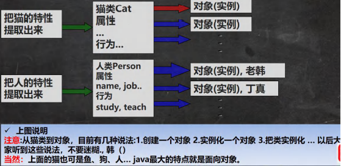
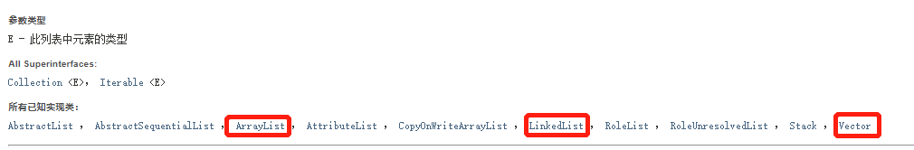
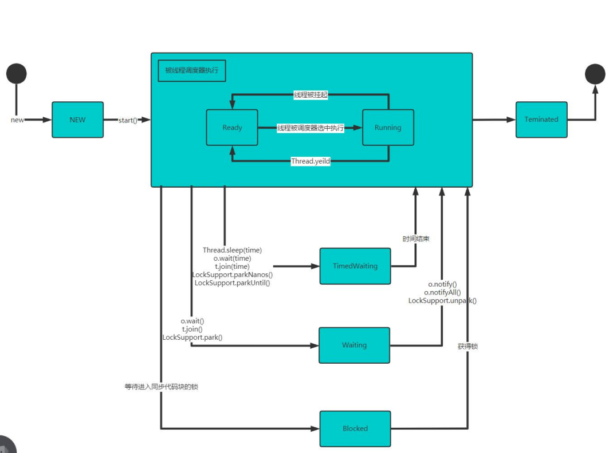
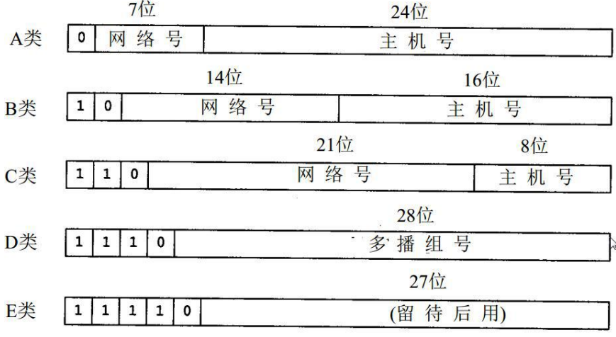

# 第一章 Java概述

#### 1.1 程序

程序：计算机执行某些操作或解决某个问题而编写的一系列有序指令的集合

#### 1.2 Java 历史

1992 创建oak (橡树)语言->java

1994 gosling参加硅谷大会演示java功能,震惊世界。

1995 sun正式发布java第1个版本。

2009年，甲骨文公司宣布收购Sun。

2011,发布java7

其它java版本发布详情https://www.oracle.com/java/technologies/java-se-support-roadmap.html

#### 1.3 Java技术体系平台

**Java SE(Java Standard Edition)标准版**

支持面向桌面级应用(如Windows 下的应用程序)的Java平台，提供了完整的Java核心API,此版本以前称为J2SE

**Java EE(Java Enterprise Edition)企业版**

是为开发企业环境下的应用程序提供的一套解决方案。该技术体系中包含的技术如:Servlet、Jsp等，主要针对于Web应用程序开发。版本以前称为J2EE

**Java ME(Java Micro Edition)小型版**

支持Java程序运行在移动终端(手机、PDA). 上的平台， 对Java API有所精简，并加入了针对移动终端的支持，此版本以前称为J2ME

#### 1.4 Java 重要特点

1. Java 语言是面向对象的(oop) 

2. Java 语言是健壮的。Java 的**强类型机制、异常处理、垃圾的自动收集**等是 Java 程序健壮性的重要保证 

3. Java 语言是**跨平台性**的。[即: 一个编译好的.class 文件可以在多个系统下运行，这种特性称为跨平台]

   

4. Java 语言是解释型的[了解] 

   解释性语言：javascript,PHP, java 

   编译性语言: c / c++ 

   区别是：解释性语言，编译后的代码，不能直接被机器执行,需要解释器来执行, 编译性语言, 编译后的代码, 可以直接被机器执行, c /c+

#### 1.5 Java 运行机制及运行过程

##### 1.5.1 跨平台性


##### 1.5.2 核心机制 JVM

1、 JVM 是一个虚拟的计算机，具有指令集并使用不同的存储区域。负责执行指令，管理数据、内存、寄存器，包含在 JDK 中。

2、 对于不同的平台，有不同的虚拟机。

3、 Java 虚拟机机制屏蔽了底层运行平台的差别，实现了“一次编译，到处运行” 


#### 1.6 什么是 JDK，JRE 

##### 1.6.1 JDK 基本介绍 

1、JDK 的全称(Java Development Kit Java 开发工具包) JDK = JRE + java 的开发工具 [java, javac,javadoc,javap 等]

2、JDK 是提供给 Java 开发人员使用的，其中包含了 java 的开发工具，也包括了 JRE。所以安装了 JDK，就不用在单独安装 JRE 了。 

##### 1.6.2 JRE 基本介绍

1、 JRE(Java Runtime Environment Java 运行环境) JRE = JVM + Java 的核心类库[类] 

2、包括 Java 虚拟机(JVM Java Virtual Machine)和 Java 程序所需的核心类库等，如果想要运行一个开发好的 Java 程序， 计算机中只需要安装 JRE 即可。 

##### 1.6.3 JDK、JRE 和 JVM 的包含关系 

1、 JDK = JRE + 开发工具集（例如 Javac,java 编译工具等) 

2、 JRE = JVM + Java SE 标准类库（java 核心类库）

3、 如果只想运行开发好的 .class 文件 只需要 JRE

#### 1.7 Java 开发注意事项和细节

1、Java源文件以java为扩展名。源文件的基本组成部分是类(class) 。

2、Java应用程序的执行入口是main()方法。 它有固定的书写格式:

`public static void main(String[] args) {..}`

3、Java语言严格区分大小写。

4、Java方法由一条条语句构成，每个语句以";"结束。

5、大括号都是成对出现的，缺一不可。[习惯， 先写{}再写代码]

6、一个源文件中最多只能有一个public类。其它类的个数不限。

7、如果源文件包含一个public类， 则文件名必须按该类名命名! 

8、一个源文件中最多只能有一个public类。 其它类的个数不限，也可以将main方法写在非public类中，然后指定运行非public类，这样入口方法就是非public 的main方法


#### 1.8 注释

1、单行注释 // 

2、 多行注释 /* */ 

3、 文档注释 /** */

#### 1.9 DOS命令（了解）

##### 1.9.1 DOS介绍

Dos ：Disk Operating System 磁盘操作系统。

##### 1.9.2 相对路径、绝对路径


##### 1.9.3 常用DOS命令

1、查看当前目录内容 dir

dir d:\abc2\test200

2、切换到其他盘下	盘符号 cd :chang directory

cd /D c:

3、切换到当前盘的其他目录下 (使用相对路径和绝对路径演示), ..\表示上一级目录 

cd d:\abc2\test200 

4、切换到上一级

 cd ..

5、切换到根目录

cd \

6、查看指定的目录下所有的子级目录

tree

7、清屏 cls

8、退出 DOS exit

# 第二章 变量

#### 2.1 变量

##### 2.1.1概念

**变量相当于内存中一个数据存储空间**的表示，你可以把变量看做是一个房间的**门牌号**，通过门牌号我们可以找到房间，而通过变量名可以访问到变量(值)。

##### 2.1.2 使用变量

```java
//1) 声明变量
	int a;
//2) 赋值
	a = 60;
	System.out.println(a);
```

#### 2.2 变量使用注意事项

1、变量表示内存中的一个存储区域 [不同的变量，类型不同，占用的空间大小不同，比如：int 4个字节，double 8个字节]

2、该区域有自己的名称[变量名]和类型[数据类型]

3、 变量必须先声明，后使用

4、该区域的数据/值可以在**同一类型**范围内不断变化

5、变量在同一个作用域内不能重名

6、变量 = 变量名 + 值 + 数据类型（**变量三要素**）

#### 2.3 程序中 + 号的使用

1、当左右两边都是数值型时，则做加法运算

2、当左右两边有一方为字符串，则做拼接运算

3、运算顺序，从左到右

#### 2.4 数据类型

每一种数据都定义了明确的数据类型，在内存中分配了不同大小的内存空间（字节）


#### 2.5 整数类型

##### 2.5.1 基本介绍

Java的整数类型就是用于存放整数值的，比如 12，30，3456 等等

##### 2.5.2 整数的类型

| 类型  | 占用存储空间 | 范围                                        |
| ----- | ------------ | ------------------------------------------- |
| byte  | 1字节        | -128 ~ 127                                  |
| short | 2字节        | -2^15~ 2^15 <br/>-32768 ~ 32767             |
| int   | 4字节        | -2^31 ~ 2^31-1<br/>-2147483648 ~ 2147483647 |
| long  | 8字节        | -2^63 ~ 2^63-1                              |

##### 2.5.3 整型的使用细节

1、Java各整数类型有固定的范围和字段长度，不受具体操作系统的影响，以保证Java程序的可移植性

2、Java的整型常量（具体值）默认为int型，声明long型常量必须后加 'l' 或 'L'

3、Java程序中变量常声明为int型，除非不足以表示大数，才使用long

4、bit: 计算机中的最小存储单位。byte: 计算机中基本存储单元，1byte = 8 bit

#### 2.6 浮点类型

##### 	2.6.1 基本介绍

Java 的浮点类型可以表示一个小数，比如 123.4，7.8，0.12 等等

##### 	2.6.2 浮点数的类型

| 类型         | 占用存储空间 | 范围                   |
| ------------ | ------------ | ---------------------- |
| 单精度float  | 4字节        | -3.403E38 ~ 3.403E38   |
| 双精度double | 8字节        | -1.798E308 ~ 1.798E308 |

##### 2.6.3 注意

1、关于浮点数在机器中存放形式的简单说明，浮点数 = 符号位 + 指数位 + 尾数位

2、尾数部分可能丢失，造成精度损失（小数都是近似值）

##### 2.6.4 浮点数的使用细节

1、与整数类型类似，Java浮点类型也有固定的范围和字段长度，不受具体OS的影响。[float 4个字节，double 8个字节]

2、Java 的浮点型常量（具体值）默认为double类型，声明float型常量，须后加 'f' 或 'F'

3、浮点型常量有两种表示形式

​	十进制数形式 ：5.12	512.0f	.512（必须有小数点）

​	科学计数法形式 ：5.12E2	5.12E-2

4、通常情况下，应该使用double型，因为它比float型更精确

5、浮点数使用陷阱： 2.7 和 8.1/3比较

#### 2.7 字符类型

##### 	2.7.1 基本介绍

字符类型可以表示单个字符，字符类型是char，char 是两个字节（可以存放汉字），多个字符我们使用字符串String。

##### 	2.7.2 字符类型的使用细节

1、字符常量是用单引号（‘ ’）括起来的单个字符

2、Java中还允许使用转义字符 '\\' 来将其后的字符转变为特殊字符型常量

3、在Java中，char的本质是一个整数，在输出时，是Unicode码对应的字符

4、可以直接给char赋一个整数，然后输出时，会按照对应的Unicode字符输出

5、char类型是可以进行运算的，相等于一个整数，因为它都对应有Unicode码

#### 2.8 布尔类型

##### 	2.8.1 基本介绍

1、布尔类型也叫boolean类型，boolean类型数据只允许取值true和false，无null

2、boolean类型占1个字节

3、boolean类型适于逻辑运算，一般用于程序流程控制

#### 2.9 基本数据类型转换

##### 	2.9.1 自动类型转换

​	

##### 2.9.2 自动类型转换注意和细节

1、有多种类型的数据混合运算时，系统首先自动将所有数据转换成容量最大的那种数据类型，然后再进行计算

2、当我们把精度(容量)大的数据类型赋值给精度(容量)小的数据类型时，就会报错，反之就会进行自动类型转换

3、(byte,short)和char之间不会相互自动转换

4、**byte、short、char 他们三者可以计算，在计算时首先转换为int类型**

5、**boolean 不参与转换**

6、自动提升原则：表达式结果的类型自动提升为操作数中最大的类型

#### 2.10 强制类型转换

##### 	2.10.1 介绍

自动类型转换的逆过程，**将容量大的数据类型转换为容量小的数据类型**。使用时要加上强制转换符()，但可能造成**精度降低或溢出**，格外要注意。

##### 	2.10.2 强制类型转换细节说明

1、当进行数据的大小从 大——>小，就需要使用到强制转换

2、强转符号只针对最近的操作数有效，往往会使用小括号提升优先级

```java
//int x = (int)10*3.5+6*1.5; 错误
int y = (int)(10*3.5+6*1.5);
System.out.println(y);
```

3、char类型可以保存int的常量值，但不能保存int的变量值，需要强转

```java
char c1 = 100; //ok
int m = 100; //ok
char c2 = m; //错误
char c3 = (char)m; //ok
```

4、byte和short，char类型在进行 运算时，当做int类型处理。

5、**boolean不参与转换**

#### 2.11 基本数据类型和String类型的转换

##### 	2.11.1 使用

基本类型转String类型语法：

​	将基本类型的值 + "" 即可

String类型转基本数据类型语法：

​	通过基本类型的包装类调用parseXX方法即可

# 第三章 运算符

#### 	3.1 运算符介绍

##### 		3.1.1 运算符介绍

运算符是一种特殊的符号，用以表示数据的运算、赋值和比较等。

​	1、算术运算符

​	2、赋值运算符

​	3、关系运算符 [比较运算符]

​	4、逻辑运算符

​	5、位运算符

​	6、三元运算符

#### 3.2 算术运算符

##### 	3.2.1 介绍

算术运算符是对数值类型的变量进行运算使用的

##### 	3.2.2 算术运算符

​		

##### 	3.2.3 使用细节

1、对于除号 "/" ，它的整数除和小数除是有区别的：整数之间做除法时，只保留整数部分而舍弃小数部分

2、当对一个数取模时，可以等价 a%b = a - a/b*b ,这样我们可以看到取模的一个本质运算

3、当 “自增”当做一个独立表达语言使用时，不管是 ++i; 还是 i++; 都是一样的，等价

4、当 “自增”当做一个表达式使用时 j = ++i; 等价 i = i + 1;j = i ;

5、当 “自增”当做一个表达式使用时 j = i++; 等价 j= i;i = i + 1;

```java
        int i = -5;
        i =  ++(i++);//报错
        System.out.println(i);
```

由于 i++后返回 -5，是个字面量，而单目运算符后面应该跟变量

#### 3.3 关系运算符

##### 	3.3.1 介绍

1、关系运算符的结果都是boolean型

2、关系表达式 经常使用在if结构的条件中或循环结构的条件中

##### 	3.3.2 关系运算符

​		

#### 3.4 逻辑运算符

##### 	3.4.1 介绍

用于连接多个条件（多个关系表达式），最终结果也是一个boolean值

##### 	3.4.2 逻辑运算符

1、短路与 &&，短路或 ||，取反 !

2、逻辑与 &，逻辑或 |，逻辑异或 ^

​	

##### 	3.4.3 && 和 & 

| 名称     | 语法           | 特点                                      |
| -------- | -------------- | ----------------------------------------- |
| 短路与&& | 条件 1&&条件 2 | 两个条件都为 true，结果为 true,否则 false |
| 逻辑与&  | 条件 1&条件2   | 两个条件都为 true，结果为 true,否则 false |

##### 	3.4.4 && 和 & 的区别

1、&&短路与

​	如果第一个条件为false，则第二个条件不会判断，最终结果为false，效率高

2、&逻辑与

​	不管第一个条件是否为false，第二个条件都要判断，效率低

##### 	3.4.5 || 和 | 

| 名称       | 语法             | 特点                                             |
| ---------- | ---------------- | ------------------------------------------------ |
| 短路或\|\| | 条件 1\|\|条件 2 | 两个条件中只要有一个成立，结果为 true,否则 false |
| 逻辑或\|   | 条件 1\|条件2    | 只要有一个条件成立，结果为 true,否则 false       |

##### 	3.4.4 || 和 |  的区别

1、短路或||

​	如果第一个条件为true，则第二个条件不会判断，最终结果为true，效率高

2、逻辑或|

​	不管第一个条件是否为true，第二个条件都要判断，效率低

#### 	3.5 取反 和 逻辑异或

##### 		3.5.1 基本规则

| 名称        | 语法        | 特点                                                |
| ----------- | ----------- | --------------------------------------------------- |
| !非（取反） | !条件       | 如果条件本身成立，结果为 false,否则 true            |
| 逻辑异或 ^  | 条件1^条件2 | 当 条件1 和 条件不同时，则结果为 true, 否则为 false |

#### 	3.6 赋值运算符

##### 		3.5.1 介绍

赋值运算符就是将某个运算后的值，赋给指定的变量

##### 		3.5.2 赋值运算符

基本赋值运算符 =

复合赋值运算符 +=, -=, *=, /=, %=

##### 		3.5.3赋值运算符特点

1、运算顺序从右往左

2、赋值运算符的左边只能是变量， 右边可以是变量、表达式、常量值

3、复合赋值运算符等价下面的效果

```java
a+=3;
//等价
a=a+3;
```

​			4、复合赋值运算符会进行类型转换

```java
byte b = 1;
b += 3; //通过
b++;//通过
b = b + 1; //错误 incompatible types: possible lossy conversion from int to byte
```

#### 	3.6 三元运算符

##### 		3.6.1 基本语法

条件表达式 ? 表达式 1: 表达式 2; 

运算规则： 

1、如果条件表达式为 true，运算后的结果是表达式 1； 

2、如果条件表达式为 false，运算后的结果是表达式 2

##### 		3.6.2 细节

1、表达式1和表达式2要为可以赋给接收变量的类型（或可以自动转换）

2、三元运算符可以转换成if-else语句

```java
int res = a > b ? a++ : --b;
if ( a > b) 
	res = a++;
else 
    res = --b;
```

#### 	3.7 运算符优先级

1、 运算符有不同的优先级，所谓优先级就是表达式运算中的运算顺序。如右表，上一行运算符总优先于下一行。 

2、只有单目运算符、赋值运算符是从右向左运算的。 

3、一览表, 不要背，使用多了，就熟悉了.


#### 	3.8 标识符的命名**规则**和**规范**

##### 		3.8.1 概念

1、Java对各种变量、方法和类等命名时使用的字符序列称为标识符

2、凡是自己可以起名字的地方都叫标识符

##### 		3.8.2 命名规则（必须遵守）

1、由26个英文字符大小写，0-9，_ 或 $ 组成

2、不可以以数字开头

3、不可以使用关键字和保留字，但能包含关键字和保留字

4、Java 中严格区分大小写，无长度限制

5、标识符不能包含空格

##### 		3.8.3 命名规范

1、 包名：多单词组成时所有字母都小写：aaa.bbb.ccc 

​	比如 com.hsp.crm 

2、类名、接口名：多单词组成时，所有单词的首字母大写XxxYyyZzz [大驼峰] 

​	比如： TankShotGame 

3、变量名、方法名：多单词组成时，第一个单词首字母小写，第二个单词开始每个单词首字母大写：xxxYyyZzz [小驼峰，简称 驼峰法] 

​	比如： tankShotGame 

4、常量名：所有字母都大写。多单词时每个单词用下划线连接：XXX_YYY_ZZZ 

​	比如 ：定义一个所得税率 TAX_RATE 

#### 	3.9 关键字

关键字的定义和特点 (不用背) 

定义：被 Java 语言赋予了特殊含义，用做专门用途的字符串（单词） 

特点：关键字中所有字母都为小写

| [abstract](https://baike.baidu.com/item/abstract)     | [assert](https://baike.baidu.com/item/assert)             | [boolean](https://baike.baidu.com/item/boolean)     | break                                                 | [byte](https://baike.baidu.com/item/byte)     |
| ----------------------------------------------------- | --------------------------------------------------------- | --------------------------------------------------- | ----------------------------------------------------- | --------------------------------------------- |
| case                                                  | [catch](https://baike.baidu.com/item/catch)               | [char](https://baike.baidu.com/item/char)           | [class](https://baike.baidu.com/item/class)           | const                                         |
| continue                                              | [default](https://baike.baidu.com/item/default)           | [do](https://baike.baidu.com/item/do)               | [double](https://baike.baidu.com/item/double)         | [else](https://baike.baidu.com/item/else)     |
| [enum](https://baike.baidu.com/item/enum)             | [extends](https://baike.baidu.com/item/extends)           | [final](https://baike.baidu.com/item/final)         | [finally](https://baike.baidu.com/item/finally)       | float                                         |
| [for](https://baike.baidu.com/item/for)               | goto                                                      | [if](https://baike.baidu.com/item/if)               | [implements](https://baike.baidu.com/item/implements) | [import](https://baike.baidu.com/item/import) |
| [instanceof](https://baike.baidu.com/item/instanceof) | [int](https://baike.baidu.com/item/int)                   | [interface](https://baike.baidu.com/item/interface) | long                                                  | native                                        |
| new                                                   | [package](https://baike.baidu.com/item/package)           | [private](https://baike.baidu.com/item/private)     | [protected](https://baike.baidu.com/item/protected)   | [public](https://baike.baidu.com/item/public) |
| [return](https://baike.baidu.com/item/return)         | [strictfp](https://baike.baidu.com/item/strictfp)         | [short](https://baike.baidu.com/item/short)         | [static](https://baike.baidu.com/item/static)         | [super](https://baike.baidu.com/item/super)   |
| [switch](https://baike.baidu.com/item/switch)         | [synchronized](https://baike.baidu.com/item/synchronized) | [this](https://baike.baidu.com/item/this)           | [throw](https://baike.baidu.com/item/throw)           | throws                                        |
| [transient](https://baike.baidu.com/item/transient)   | try                                                       | [void](https://baike.baidu.com/item/void)           | [volatile](https://baike.baidu.com/item/volatile)     | [while](https://baike.baidu.com/item/while)   |


#### 	3.10 保留字

Java 保留字：现有 Java 版本**尚未使用**，但**以后版本可能会作为关键字使用**。自己命名标识符时要避免使用这些保留字：byValue, cast, **false**, future, generic, inner,  operator, outer, rest, **true**, var, **goto**  （保留关键字）  ,   **const**  （保留关键字）  ,   **null**

#### 	3.11 进制

对于整数，有四种表示方式： 

二进制：0,1 ，满 2 进 1.以 **0b 或 0B** 开头。 

十进制：0-9 ，满 10 进 1。 

八进制：0-7 ，满 8 进 1. 以数字 0 开头表示。 

十六进制：0-9 及 A(10)-F(15)，满 16 进 1. 以 **0x 或 0X** 开头表示。此处的 A-F 不区分大小

#### 	3.12 原码、反码、补码（重点）

1、二进制的最高位是符号位: 0表示正数，1表示负数

2、正数的原码，反码，补码都一样(三码合一)

3、负数的反码 = 它的原码符号位不变，其它位取反(0->1,1->0)

4、负数的补码 = 它的反码+1 ,负数的反码=负数的补码 - 1

5、0的反码，补码都是0

6、java**没有无符号数**，换言之，java中的数都是有符号的

7、在计算机运算的时候，都是以**补码的方式来运算**的.

8、当我们看运算结果的时候，要看他的原码(重点)

[深入理解计算机中的原码、补码、反码 - 知乎 (zhihu.com)](https://zhuanlan.zhihu.com/p/371184302)

#### 3.13 位运算符

位运算符 >>、<< 和 >>> 

1、算术右移 >>：低位溢出,符号位不变,并用符号位补溢出的高位 

2、算术左移 <<: 符号位不变,低位补 0 

3、 >>> 逻辑右移也叫无符号右移,运算规则是: 低位溢出，高位补 0 

4、特别说明：没有 <<< 符号


# 第四章 流程控制介绍

#### 	4.1 程序流程控制

三大流程控制语句

1、顺序控制

2、分支控制

3、循环控制

#### 	4.2 顺序控制

程序从上到下逐行地执行，中间没有任何判断和跳转

#### 	4.3 分支控制 if-else

##### 		4.3.1 介绍

分支控制有三种：

1、单分支 if

2、双分支if-else

3、多分支 if-else if-...-else

##### 		4.3.2 单分支

基本语法：

```java
	if(条件表达式){
        执行代码块; （可以有多条语句）
    }
```

说明：

当条件表达式为true是，就会执行 {} 的代码。如果为false，就不执行。

##### 		4.3.2 双分支

基本语法：

```java
	if(条件表达式){
        执行代码块1;
    } else {
        执行代码块2;
    }
```

说明：

当条件表达式为true是，即执行代码块1，否则执行代码块2。

##### 		4.3.3 多分支

基本语法：

```java
	if(条件表达式){
        执行代码块1;
    } else if(条件表达式2){
        执行代码块2;
    }...
     else{
         执行代码块n;
     }
```

说明：

1、多分支可以没有 else ，如果所有的条件表达式都不成立，则一个执行入口都没有

2、如果有 else ，如果所有的条件表达式都不成立，则默认执行 else 代码块

#### 	4.4 嵌套分支

##### 		4.4.1 介绍

在一个分支结构中又完整的嵌套了另一个完整的分支结构，里面的分支的结构称为内层分支外面的分支结构称为外 层分支。

##### 		4.5.2 基本语法

```java
	if(){
        if(){
            //if-else ...
        } else{
            //if-else
        }
    }
```

#### 	4.5 switch分支结构

##### 	4.5.1 基本语法

```java
	switch(表达式){
            case 常量1：
                语句块;
            	break;
             case 常量2：
                语句块;
            	break;
            ...
             case 常量n：
                语句块;
            	break;
           	default;
            	语句块;
            break;
    }
```

#### 	4.6 switch 和 if 的比较

1、如果**判断的具体数值不多**，而且符合byte、short、int、char、enum、String 这6种类型，建议使用switch。

2、其他情况：对区间判断，对结果为boolean类型判断，使用if。

#### 	4.7 循环控制 for

##### 		4.7.1 基本语法

```java
	for(循环变量初始化;循环条件;循环变量迭代){
       	代码块;
    }
```

1、for 关键字，表示循环控制 

2、for 有四要素: (1)循环变量初始化(2)循环条件(3)循环操作(4)循环变量迭代 

3、循环操作 , 这里可以有多条语句，也就是我们要循环执行的代码 

4、如果 循环操作(语句) 只有一条语句，可以省略 {}, 建议不要省略

#### 	4.8 循环控制 while

##### 		4.8.1 基本语法

```java
	循环变量初始化;
	while(循环条件){
        代码块;
        循环变量迭代;
    }
```

1、 循环条件是返回一个布尔值的表达式 

2、 while 循环是先判断再执行语句

#### 	4.9 循环控制 do... while

##### 		4.9.1 基本语法

```java
	循环变量初始化;
	do{
        代码块;
        循环变量迭代;
    }while(循环条件);
```

1、 do while 是关键字 

2、也有循环四要素, 只是位置不一样 

3、先执行，再判断，也就是说，一定会至少执行一次 

4、最后 有一个 分号 

#### 	4.10 多重循环控制

##### 		4.10.1 介绍

1、 将一个循环放在另一个循环体内，就形成了嵌套循环。其中，for ,while ,do…while 均可以作为外层循环和内层循环。

2、 实质上，嵌套循环就是把内层循环当成外层循环的循环体。当只有内层循环的循环条件为 false 时，才会完全跳出内 层循环，才可结束外层的当次循环，开始下一次的循环

3、设外层循环次数为 m 次，内层为 n 次，则内层循环体实际上需要执行 m*n 次。

#### 	4.11 跳转控制语句 break

##### 		4.11.1 基本介绍

**break 语句用于终止某个语句块的执行**，一般使用在 switch 或者循环[for , while , do-while]

##### 		4.11.2 基本语法

```java
		{
            ...
            break;
            ...
        }
```

#### 	4.12 跳转控制语句 continue

##### 		4.12.1 基本介绍

1、**continue 语句用于结束本次循环，继续执行下一次循环**。 

2、continue 语句出现在多层嵌套的循环语句体中时，可以通过标签指明要跳过的是哪一层循环 , 这个和前面的标签的 使用的规则一样.

##### 		4.12.2 基本语法

```java
		{
            ...
            continue ;
            ...
        }
```

#### 	4.13 跳转控制语句 return

return 使用在方法，表示跳出所在的方法

# 第五章 数组、排序和查找

#### 	5.1 数组

##### 		5.1.1 介绍

数组可以存放多个同一类型的数据。数组也是一种数据类型，是**引用类型**。 

即：数(数据)组(一组)就是一组数据

#### 	5.2 数组的使用

##### 		5.2.1 动态初始化

1、数组的定义

数据类型 数组名[] = new 数据类型[大小]

int a[] = new int[5];//创建了一个数组，名字a，存放5个int			

2、数组的引用（使用/访问/获取数组元素）

数组名[下标/索引/index]

##### 		5.2.2 静态初始化

1、初始化数组

​	语法：数据类型 数组名[] ={ 元素值 , 元素值 }

​	int a[] = {2,5,6,10,20,30,88}

#### 	5.3 数组使用注意事项和细节

1、数组是多个相同类型数据的组合，实现对这些数据的统一管理

2、数组中的元素可以是任何数据类型，包括基本类型和引用类型，但是不能混用。

3、数组创建后，如果没有赋值，有默认值

​	int 0, short 0, byte 0, long 0, float 0.0,double 0.0，char \u0000，boolean false, String null

4、使用数组的步骤 1. 声明数组并开辟空间;2.给数组各个元素赋值;3.使用数组

5、数组的下标是从0开始的。

6、数组下标必须在指定范围内使用，否则报:下标越界异常， 比如

​	int[] arr = new int[5];//有效下标 0-4

7、数组属引用类型，数组型数据是对象(object)

#### 	5.4 数组赋值机制

1、基本数据类型赋值，这个值就是具体的数据，而且不相互影响。

2、数组在默认看情况下是引用传递，赋的值是地址。

#### 		5.5 排序

排序是将多个数据，依指定的顺序进行排列的过程

##### 				5.5.1 内部排序

指将需要处理的所有数据都加载到内部存储器中进行排序。包括(交换式排序法、选择 式排序法和插入式排序法)；

##### 				5.5.2 外部排序

数据量过大，无法全部加载到内存中，需要借助外部存储进行排序。包括(合并排序法和直接合并排序法)。

#### 		5.6 多维数组 - 二维数组

##### 				5.6.1 使用方式1：动态初始化

语法： 类型[]\[] 数组名 =new 类型[大小]\[大小]

##### 				5.6.2 使用方式2：动态初始化

语法：

​	先声明： 类型 数组名[]\[]

​	在定义 数组名 = new 类型[大小]\[大小]

##### 				5.6.3 使用方式3：动态初始化 - 列数不确定

int[]\[] arr = new int[3]\[];

##### 				5.6.4 使用方式4：静态初始化

类型 数组名[]\[] = {{值 1,值 2..},{值 1,值 2..},{值 1,值 2..}}

#### 	5.7 二维数组使用细节和注意事项

1、一维数组的声明方式有：

​	int[] x 或者 int x[]

2、二维数组的声明方式有：

​	int[]\[] y 或者 int[] y[] 或者 int y[]\[]

3、二维数组实际上是由多个一维数组组成的，它的各个一维数组的长度可以相同，也可以不同。


# 第六章 面向对象编程（基础部分）

#### 	6.1 类与对象

##### 		6.1.1 类与对象的关系

1、类就是数据类型

2、对象就是一个具体的实例（类的实例化）

​		

##### 		6.1.2 类和对象的区别和联系

1、类时抽象的，概念的，代表一类事物，比如人类、猫类，即它是数据类型

2、对象是具体的，实际的，代表一个具体事物，即是实例

3、类时对象的模板，对象是类的一个个体，对应一个实例

##### 		6.1.3 对象在内存中存在的形式（重要）

​			

##### 		6.1.4 属性/成员变量/字段

基本介绍：

1、从概念或叫法上看：成员变量 = 属性 = field(字段) 

2、属性是类的一个组成部分，一般是基本数据类型,也可是引用类型(对象，数组)

注意事项和细节说明：

1、属性的定义语法同变量，示例：访问修饰符 属性类型 属性名;

2、属性的定义类型可以为任意类型，包含基本类型或引用类型

3、属性如果不赋值，有默认值，规则和数组一致。

##### 		6.1.5 创建对象

1、 先声明再创建 

​		Cat cat ; //声明对象 

​		cat cat = new Cat(); //创建 

2、直接创建 Cat cat = new Cat();

##### 		6.1.6 访问属性

基本语法

​				对象名.属性名

​			类和对象的内存分配机制(重要)

​			

##### 		6.1.7 类和对象的内存分配机制

Java 内存的结构分析 

1、栈： 一般存放基本数据类型(局部变量) 

2、堆： 存放对象(Cat cat , 数组等) 

3、 方法区：常量池(常量，比如字符串)， 类加载信息

#### 	6.2 成员方法

##### 		6.2.1 成员方法的定义

```java
访问修饰符 返回数据类型 方法名（形参列表..） {//方法体
		语句；
		return 返回值;
}
```

1、形参列表：表示成员方法输入 cal(int n) ， getSum(int num1, int num2)

2、 返回数据类型：表示成员方法输出, void 表示没有返回值

3、方法主体：表示为了实现某一功能代码块

4、return 语句不是必须的

#### 	6.3 方法递归调用（非常非常重要）

##### 			6.3.1 基本介绍

**递归就是方法自己调用自己**，每次调用时传入不同的变量。递归有助于编程者解决复杂问题，同时可以让代码变得简洁

##### 			6.3.2 递归重要规则

1、执行一个方法时，就创建一个新的受保护的独立空间(栈空间)

2、方法的局部变量是独立的，不会相互影响，比如n变量

3、如果方法中使用的是引用类型变量(比如数组，对象)，就会共享该引用类型的数据

4、递归必须向退出递归的条件逼近，否则就是无限递归,出现StackOverflowError,死龟了:)

5、当一个方法执行完毕，或者遇到return,就会返回，遵守谁调用，就将结果返回给谁，同时当方法执行完毕或者返回时，该方法也就执行完毕。

#### 	6.4 重载（OverLoad）

##### 		6.4.1 基本介绍

java 中允许同一个类中，多个同名方法的存在，但要求形参列表不一致

##### 		6.4.2 重载的好处

1、 减轻了起名的麻烦 

2、 减轻了记名的麻烦

##### 		6.4.3 注意事项和使用细节

1、方法名：必须相同

2、形参列表：必须不同（形参类型或个数或顺序，至少有一样不同，参数名无要求）

3、返回类型：无要求（即只有返回类型不同，不叫重载）

#### 	6.5 可变参数

##### 		6.5.1 基本概念

java 允许将同一个类中多个同名同功能但参数个数不同的方法，封装成一个方法

##### 		6.5.2 基本语法

```java
	访问修饰符 返回类型 方法名(数据类型... 形参名) {
	}
```

##### 		6.5.3 注意事项和使用细节

1、可变参数的实参可以为0个或任意多个

2、可变参数的实参可以为数组

3、可变参数的本质就是数组

4、可变参数可以和普通类型的参数一起放在形参列表，但必须保证可变参数在最后

5、一个形参列表中只能出现一个可变参数

#### 	6.6 作用域

##### 		6.6.1 基本使用

1、在Java编程中，主要的变量就是属性（成员变量）和局部变量

2、局部变量一般是指在成员方法中的定义的变量

3、Java中的作用域的分类

​	全局变量：也就是属性，作用域为整个类体

​	局部变量：也就是除了属性之外的其他变量，作用域为定义它的代码块中！'{ }'

4、全局变量(属性)可以不赋值，直接使用，因为有默认值，局部变量必须赋值后才能使用。

##### 6.6.2 注意事项和使用细节

1、属性和局部变量可以重名，访问时遵循就近原则

2、在同一个作用域中，比如在同一个成员方法中，两个局部变量，不能重名

3、属性生命周期较长，伴随对象的创建而创建，伴随着对象的销毁而销毁。局部变量，生命周期较短，伴随着它的代码块的执行而创建，伴随着代码块的结束而销毁

4、作用域范围不同

​	全局变量/属性：可以被本类使用，或其他类使用（通过对象调用）

​	局部变量：只能在本类中对应的方法中使用

5、修饰符不同

​	全局变量/属性可以加修饰符

​	局部变量不可以加修饰符

#### 6.7 构造方法/构造器

##### 		6.7.1 基本语法

```java
    [修饰符] 方法名(形参列表){
        方法体;
    }	
```

1、构造器的修饰符可以默认， 也可以是 public protected private

2、构造器没有返回值

3、方法名和类名字必须一样

4、参数列表和成员方法一样的规则

5、构造器的调用，由系统完成

##### 		6.7.2 基本介绍

构造方法又叫构造器(constructor)，是类的一种特殊的方法，它的主要作用是完成对新对象的初始化。

1、 方法名和类名相同

2、没有返回值

3、在创建对象时，系统会自动的调用该类的构造器完成对象的初始化

##### 		6.7.3 注意事项和使用细节

1、一个类可以定义多个不同的构造器，即构造器重载

2、构造器名和类名要相同

3、构造器没有返回值

4、**构造器是完成对象的初始化，并不是创建对象**

5、在创建对象时，系统自动的调用该类的构造方法

6、如果程序员没有定义构造器，系统会自动给类生成一个默认无参构造器

7、一旦定义了自己的构造器，默认的构造器就覆盖了，就不能再使用默认的无参构造器了，除非显示的定义一下

8、以下方式创建对象会调用构造方法

​	new 语句创建对象

​	java反射机制使用 java.lang.Class 或java.lang.reflect.Constructor 的newInstance() 方法

#### 	6.8 对象创建的流程分析

```java
class Person{
    int age = 90;
    String name;
    Person(String n,int a){
        this.age = a;
        this.name = n;
    }
}
Person p = new Person("小倩",20);
```

流程分析

1、加载Person类信息（Person.class），只会加载一次

2、在堆中分配空间（地址）

3、**完成对象初始化**   

[

3.1默认初始化 age=0 name=null 

3.2显示初始化 age=90 name=null

3.3构造器的初始化 age=20 name=小倩

]

4、将对象在堆中的地址返回给p（p是对象名）

#### 	6.9 this关键字

##### 		6.9.1 this

Java虚拟机会给每个对象分为this，代表当前对象。

##### 		6.9.2 this的注意事项和使用细节

1、this关键字可以用来访问本类的属性、方法、构造器

2、this用于区分当前类的属性和局部变量

3、访问成员方法的语法：this.方法名(参数列表);

4、访问构造器语法：this(参数列表); 

​	注意只能在构造器中使用（即只能在构造器中访问另一个构造器，**必须放在第一条语句**）

5、this不能在类定义的外部使用，只能在类定义的方法中使用

# 第七章 面向对象编程（中级部分）

#### 	7.1 包

##### 		7.1.1 包的三大作用

1、区分相同名字的类

2、当类很多时，可以很好的管理类

3、控制访问范围

##### 		7.1.2 基本语法

package com.xxx;

1、package 关键字，表示打包

2、com.xxx 表示包名

##### 		7.1.3 包的本质分析

包的本质实际上就是创建不同的文件夹/目录来保存类文件

##### 		7.1.4 包的命名

命名规则：

​	只能包含数字、字母、下划线、小圆点. ，但不能用数字开头，不能是关键字或保留字

命名规范：

​	一般是小写字母 + 小圆点

​	com.公司名.项目名.业务模块名

##### 		7.1.5 注意事项和使用细节

1、package 的作用是声明当前类所在的包，需要放在类的最上面，一个类中最多只有一句package

2、import 指令位置放在package的下面，在类定义前面，可以有多句且没有顺序要求

#### 	7.2 访问修饰符

##### 		7.2.1 基本介绍

java 提供四种访问控制修饰符号，用于控制方法和属性(成员变量)的访问权限（范围）

1、公开级别:用 public修饰,对外公开

2、受保护级别:用 protected 修饰,对子类和同一个包中的类公开

3、默认级别:没有修饰符号,向同一个包的类公开

4、私有级别:用 private 修饰,只有类本身可以访问,不对外公开

##### 		7.2.2 4种访问修饰符的访问范围

​			

##### 		7.5.3 注意事项和使用细节

1、修饰符可以用来修饰类中的属性，成员方法以及类

2、只有默认的和public才能修饰类!，并且遵循上述访问权限的特点。

3、成员方法的访问规则和属性完全一样.

#### 7.6 面向对象编程三大特征

##### 		7.6.1 基本介绍

面向对象编程有三大特征：封装、继承和多态

##### 		7.6.2 封装介绍

封装就是把抽象出的数据[**属性**]和对数据的操作[**方法**]封装在一起，数据被保护在内部，程序的其他部分只有通过被授权的操作[**方法**]，才能对数据进行操作。

##### 		7.6.3 封装的理解和好处

1、隐藏实现细节

2、可以对数据进行验证，保证安全合理

##### 		7.6.4 封装的实现步骤

​	1、将属性进行私有化private 【不能直接修改属性】

​	2、提供一个公共的(public)set方法，用于对属性判断并赋值

​	3、提供一个公共的(public)get方法，用于获取属性的值

#### 	7.7 继承

##### 		7.7.1 基本介绍

​	继承可以解决代码复用,让我们的编程更加靠近人类思维。当多个类存在相同的属性(变量)和方法时,可以从这些类中抽象出父类,在父类中定义这些相同的属性和方法，所有的子类不需要重新定义这些属性和方法，只需要通过 extends 来 声明继承父类即可。画出继承的示意图

​	

##### 		7.7.2 基本语法

```java
class 子类 extends 父类{
    
}
```

​	1、子类就会自动拥有父类定义的属性和方法

​	2、父类又叫超类、基类

​	3、子类又叫派生类

##### 		7.7.3 继承的好处

​	1、代码的复用性提高了

​	2、代码扩展性和维护性提高了

##### 		7.7.4 继承的细节

​	1、**子类继承了所有的属性和方法**，非私有的属性和方法可以在子类直接访问, 但是私有属性和方法不能在子类直接访 问，要通过父类提供公共的方法去访问

​	2、 子类必须调用父类的构造器， 完成父类的初始化

​	3、当创建子类对象时，不管使用子类的哪个构造器，默认情况下总会去调用父类的无参构造器，如果父类没有提供无参构造器，则必须在子类的构造器中用 super 去指定使用父类的哪个构造器完成对父类的初始化工作，否则，编译不会通过。

​	4、如果希望指定去调用父类的某个构造器，则显式的调用一下 : super(参数列表)

​	5、super 在使用时，必须放在构造器第一行(super 只能在构造器中使用)

​	6、super() 和 this() 都只能放在构造器第一行，因此这两个方法不能共存在一个构造器

​	7、java 所有类都是 Object 类的子类, Object 是所有类的基类.

​	8、父类构造器的调用不限于直接父类！将一直往上追溯直到 Object 类(顶级父类)

​	9、子类最多只能继承一个父类(指直接继承)，即 java中是单继承机制

​	10、不能滥用继承，子类和父类之间必须满足 is-a 的逻辑关系

#### 	7.8 super 关键字

##### 		7.8.1 基本介绍

​	super代表父类的引用，用于访问父类的属性、方法、构造器

##### 		7.8.2 基本语法

​	1、访问父类的属性，但不能访问父类的private属性

super.属性名;

​	2、访问父类的的方法，不能访问父类的private方法

super.方法名(参数列表);

##### 7.8.3 super的好处

1、调用父类的构造器的好处（分工明确，父类属性由父类初始化，子类属性由子类初始化）

2、当子类中有父类的成员（属性和方法）重名时，为了访问父类的成员，必须通过super。如果没有重名，使用super、this、直接访问是一样的效果

3、super的访问不限于直接父类，如果爷爷类和本类中有同名的成员，也可以使用super去访问爷爷类的成员；如果多个基类（上级类）中都有同名的成员，使用super访问遵循就近原则。A->B->C，当然也需要遵守访问权限的相关规则

##### 7.8.4 super 和this 的比较

| 区别       | this                                                   | super                                    |
| ---------- | ------------------------------------------------------ | ---------------------------------------- |
| 访问属性   | 访问本类中的属性，如果本类没有此属性则从父类中继续查找 | 从父类开始查找属性                       |
| 调用方法   | 访问本类中的方法，如果没类没有此方法则从父类继续查找   | 从父类开始查找方法                       |
| 调用构造器 | 调用本类构造器，必须放在构造器的首行                   | 调用父类构造器，必须放在子类构造器的首行 |
| 特殊       | 表示当前对象                                           | 子类中访问父类对象                       |

#### 7.9 方法重写/覆盖（override）

##### 7.9.1 基本介绍

方法覆盖（重写）就是子类有一个方法，和父类的某个方法的名称、返回类型、参数一样，那么我们就说子类的这个方法覆盖了父类的方法

##### 7.9.2 注意事项和使用细节

方法重写也叫方法覆盖，需要满足以下条件：

​	1、子类的方法的**形参列表**，**方法名称**，要和父类的**形参列表**，**方法名称**完全一样

​	2、子类方法的返回类型和父类方法返回类型一样，或者父类返回类型的子类

**比如**父类返回类型是Object ，子类方法返回类型是String

```java
	public Object getInfo(){}

	public String getInfo(){}
```

​	3、子类方法不能缩小父类方法的访问权限，即子类方法的访问范围要大于等于父类

##### 7.9.3 重写和重载的比较

| 名称           | 发生范围 | 方法名   | 形参列表                     | 返回类型                                                   | 修饰符                          |
| -------------- | -------- | -------- | ---------------------------- | ---------------------------------------------------------- | ------------------------------- |
| 重载(overload) | 本类     | 必须一样 | 类型、个数、顺序至少一个不同 | 无要求                                                     | 无要求                          |
| 重写(override) | 父子类   | 必须一样 | 相同                         | 子类重写的方法的返回类型和父类返回的类型一致，或者是其子类 | 子类方法不能缩小父类的 访问范围 |

#### 7.10 多态

##### 7.10.1 基本介绍

方法或对象具有多种形态。是面向对象的第三大特性，多态是建立在封装和继承基础之上的

##### 7.10.2 多态的具体体现

1、方法的多态

​	重写和重载就体现多态

2、对象的多态

​	1）一个对象的编译类型和运行类型可以不一致

​	2）编译类型在定义对象时，就确定了，不能改变

​	3）运行类型是可以发生变化的

​	4）编译类型看定义时 = 号的左边，运行类型看 = 号的右边

##### 7.10.3 多态注意事项和使用细节

1、多态的前提是：两个对象（类）存在继承关系

2、多态的向上转型

​	1）本质：父类的引用指向了子类的对象

​	2）语法：父类类型 引用名  =  new 子类类型();
​	3）特点：编译类型看左边，运行类型看右边

​	可以调用父类中的所有成员（需遵循访问权限）

​	不能调用子类中特有的成员

3、多态向下转型

​	1）语法：子类类型 引用名 = (子类类型) 父类引用;

​	2）只能强转父类的引用，不能强转父类的对象

​	3）要求父类的引用必须指向的是当前目标类型的对象

​	4）当向下转型后，可以调用子类类型中所作的成员

##### 7.10.4  Java的动态绑定机制（非常非常重要）

```java
class Base{
    int count = 10;
    public void display(){
        System.out.println(this.count);
    }
}
class Sub extends Base{
    int count = 2
        0;
    public void display(){
        System.out.println(this.count);
    }
}
public static void main(String[] args){
    Sub s = new Sub();
    System.out.println(s.count);//20
    s.display();//20
    Base b = s;
    System.out.println(b.count);//10
    b.display();//20
}
```

1、当调用对象方法的时候，**该方法会和该对象的内存地址/运行类型**绑定

2、当调用对象属性时，没有动态绑定机制，哪里声明，哪里使用

#### 7.11 Object类

##### 7.11.1 equals方法

== 和 equals 的对比

== 是一个比较运算符

1、==：既可以判断基本类型，又可以判断引用类型

2、==：如果判断基本类型，判断的是值是否相等

3、==：如果判断引用类型，判断的是地址是否相等，即判定是不是同一个对象

4、equals：是Object类中的方法，只能判断引用类型

5、默认判断的是地址是否相等，子类中往往重写该方法，用于判断内容是否相等

##### 7.11.2 hashCode

public int hashCode{}

返回该灯箱的哈希码值，支持此方法是成为了提高哈希表的性能。

hashCode的常规协定是：

1、在Java应用程序执行期间，在对同一对象多次调用hashCode方法时，必须一致地返回相同的整数，前提是将对象进行equals比较时所用的信息没有被修改。从某一应用程序的一次执行到同一应用程序的另一次执行，该整数无需保持一致。

2、如果根据equals(Object)方法，两个对象不相等，那么对这两个对象中的每个对象调用hashCode方法都必须生成相同的整数结果

3、如果根据equals(Object)方法，两个对象不相等，那么对这两个对象中的任一对象上调用hashCode方法不要求一定生成不同的整数结果。但是，程序员应该意识到，为不相等的对象生成不同整数结果可以提高哈希表的性能

实际上，由Object类定义的hashCode方法确实会针对不同的对象返回不同的整数

##### 7.11.3 toString 方法

1）基本介绍

默认返回：全类名+@+哈希值的十六进制

子类往往重写toString方法，用于返回对象的属性信息

2）重写toString方法，打印对象或拼接对象时，都会自动调用该对象的toString形式

3）当直接输出一个对象时，toString方法会被默认的调用，比如System.out.println(object)；就会默认调用object.toString()

##### 7.11.4  finalize 方法

1、**当对象被回收**时，系统自动调用该对象的finalize方法。子类可以重写该方法，做一些释放资源的操作

2、什么时候被回收：当某个对象没有任何引用时，则jvm就认为这个对象是一个垃圾对象，就会使用垃圾回收机制来销毁该对象，在销毁该对象前，会先调用finalize方法

3、垃圾回收机制的调用，是由系统来决定（即有自己的GC算法），也可以通过System.gc()主动触发垃圾回收机制


这个方法一个对象只能执行一次，只能在第一次进入被回收的队列，而且对象所属于的类重写了finalize方法才会被执行。第二次进入回收队列的时候，不会再执行其finalize方法，而是直接被二次标记，在下一次GC的时候被GC。


# 第八章 面向对象编程（高级部分）

#### 8.1 类变量和类方法

##### 8.1.1 类变量

类变量也叫静态变量/静态属性，是该类的所有对象共享的变量，任何一个该类的对象去访问它时，取到的都是相同的值，同样任何一个该类的对象取修改它时，修改的也是同一个变量。

##### 8.1.2 定义类变量

定义语法：

访问修饰符 static 数据类型 变量名;[推荐]

static 访问修饰符 数据类型 变量名;

##### 8.1.3 访问类变量

类型.类变量名 [推荐]

或者 对象名.类变量名

##### 8.1.4类变量名使用注意事项和细节

1、类变量与实例变量的区别

类变量是该类所有对象共享的，而实例变量是每个对象独享的

2、加上static称为类变量或静态变量，否则称为实例变量/普通变量/非静态变量

3、类变量可以通过 类名.类变量名 或者 对象名.类变量名 来访问

4、实例变量不能通过 类名.类变量名访问

5、类变量是在类加载时就初始化了，也就是说，即使没有创建对象，只要类加载了，就可以使用类变量名

6、类变量的生命周期是随类的加载开始，随着类消亡而销毁

##### 8.1.5 类方法

类方法也叫静态方法

形式如下：

访问修饰符 static 数据类型 方法名(){};[推荐]

static 访问修饰符 数据类型 方法名(){};

##### 8.1.6 类方法的调用

使用方式

类型.类方法名 [推荐]

或者 对象名.类方法名

##### 8.1.7 类方法使用注意事项和细节

1、类方法和普通方法都是随着类的加载而加载，将结构信息存储在方法去

​	类方法中**无this**的参数

​	普通方法中隐含着this的参数

2、类方法可以通过类名调用，也可以通过对象名调用

3、普通方法和对象有关，需要通过对象名调用，不能通过类名调用

4、类方法中不允许使用和对象有关的关键字，比如this和super。普通方法可以

5、类方法中只能访问静态变量或静态方法

6、普通成员方法既可以访问非静态成员，也可以访问静态成员

#### 8.2 理解 main 方法语法

##### 8.2.1 深入理解main方法

main方法的形式

```java
public static void main(String[] args){}
```

1、main方法是虚拟机调用

2、Java虚拟机需要调用类的main()方法，所以该方法的访问权限必须是public

3、Java虚拟机在执行main()方法时不必创建对象，所以该方法必须是static

4、该方法接收String类型的数组参数，该数组中保存执行Java命令时传递所运行的类的参数，接收参数

##### 8.2.2 特别说明

1、在 main()方法中，我们可以直接调用 main 方法所在类的静态方法或静态属性。

2、但是，不能直接访问该类中的非静态成员，必须创建该类的一个实例对象后，才能通过这个对象去访问类中的非静 态成员

#### 8.3 代码块

##### 8.3.1 基本介绍

代码块又称为初始化块，属于类中的成员[即是类的一部分]，类似于方法，将逻辑语句封装在方法体中，通过 {} 包围起来，但和方法不同，没有方法名，没有返回，没有参数，只有方法体，而且不用通过对象或类显式调用，而是加载类时，或创建对象时隐式调用

##### 8.3.2 基本语法

[修饰符]{

​	代码;

};

说明：

1、修饰符可选，要写的话只能写static

2、代码块分为两类，使用static修饰的叫静态代码块，没有static修饰的，叫普通代码块/非静态代码块

3、逻辑语句可以为任何逻辑语句（输入、输出、方法调用、循环、判断）

4、;号可以写上，也可以省略

##### 8.3.3 代码块的好处

1、相等于另一种形式的构造器（对构造器的补充机制），可以做初始化的操作

2、场景：如果多个构造器中都有重复的语句，可以抽取到初始化块中，提高代码的重用性

##### 8.3.4 代码块使用注意事项和细节

1、static代码块也叫静态代码块，作用就是对类进行初始化，而且它随若**类的加载**而执行，井且**只会执行一次**。如果是普通代码块，每创建一个对象，就执行一次

2、类什么时候被加载[重要背!]

​	①创建对象实例时(new)

​	②创建子类对象实例，父类也会被加载

​	③使用类的静态成员时(静态属性，静态方法)

3、普通的代码块，在创建对象实例时，会被隐式的调用。

被创建一次，就会调用次。

如果只是使用类的静态成员时，普通代码块并不会执行。

小结:

​	1.static代码块是**类加载**时，执行，只会执行一次

​	2.普通代码块是在创建对象时调用的，创建一次，调用一次

​	3.类加载的3种情况，需要记住.

4、创建个对象时，在**一个类** 调用顺序是:

①调用静态代码块和静态属性初始化(注意:静态代码块和静态属性初始化调用的优先级一样，如果有多个静态代码块和多个静态变量初始化，则按他们定义的顺序调用) 

②调用普通代码块和普通属性的初始化(注意:普通代码块和普通属性初始化调用的优先级一样，如果有多个普通代码块和多个普通属性初始化，则按定义顺序调用)

③调用构造方法。

5、构造器 的在最前面其实隐含了 super() 和调用普通代码块，静态相关的代码块，属性初始化，在类加载时，就执行完毕

```java
class A{
    public A(){//构造器
        //这里有隐藏的执行要求
        //（1）super();
        //（2）调用普通代码块
        System.out.println("ok");
    }
}
```

6、创建一个子类对象时（继承关系），他们的静态代码块，静态属性初始化，普通代码块，普通属性初始化，构造方法的调用顺序如下：

①父类的静态代码块和静态属性(优先级一样，按定义顺序执行)

②子类的静态代码块和静态属性(优先级一样，按定义顺序执行)

③父类的普通代码块和普通属性初始化(优先级-一样，按定义顺序执行)

④父类的构造方法

⑤子类的普通代码块和普通属性初始化(优先级一样，按定义顺序执行)

⑥子类的构造方法

7、静态代码块只能直接调用静态成员（静态属性和静态方法），普通代码块可以调用任意成员

#### 8.4 单例设计模式

##### 8.4.1 设计模式

1、静态方法和属性的经典使用

2、设计模式是在大量的实践中总结和理论化之后优选的代码结构、编程风格以及解决问题的思考方式

##### 8.4.2 单例模式

单例（单个实例）

1、所谓类的单例设计模式，就是采取一定的方法保证在整个的软件系统中，对某个类只能存在一个对象实例，并且该类只提供一个取得对象实例的方法

2、单例模式有两种方式

1）饿汉式

2）懒汉式

##### 8.4.3 单例模式应用

饿汉式 和懒汉式单例模式的实现

步骤如下：

1）构造器私有化 =》 防止直接 new

2）类的内部创建对象

3）向外暴露一个静态的公共方法

##### 8.4.4 饿汉式 vs 懒汉式

1、二者最主要的区别在与创建对象的**时机不同**

​	饿汉式是在类加载就创建了对象实例

​	而懒汉式是在使用时才创建

2、饿汉式不存在线程安全问题，懒汉式存在线程安全问题

3、饿汉式存在浪费资源的可能。因为如果程序员一个对象实例对没有使用，那么饿汉式创建的对象就浪费了，懒汉式是使用时才创建，就不存在这个问题

4、在 JavaSE标准类中，java.lang.Runtime就是经典的单例模式

#### 8.5 final 关键字

##### 8.5.1 基本介绍

final可以修饰类、属性、方法和局部变量

1、当不希望类被继承时，可以使用final修饰

2、当不希望父类的某个方法被子类覆盖/重写(override)时，可以用final关键字修饰

3、当不希望类的某个属性的值被修改，可以用final修饰

4、当不希望某个局部变量被修改，可以使用final修饰

##### 8.5.2 final 使用注意事项和细节

1、final修饰的属性又叫常量，一般 用 XX_XX_XX 来命名

2、final修饰的属性在定义时，必须赋初值，并且以后不能再修改，赋值可以在如下位置之一

​	①定义时：如public final double TAX_RATE=0.08;

​	②在构造器中

​	③在代码中

3、如果final修饰的属性是静态的，则初始化的位置只能是

​	①定义时

​	②在静态代码块 不能再构造器中赋值

4、final类不能继承，但是可以实例化对象

5、如果类不是final类，但是含有final方法，则该方法虽然不能重写，但是可以被继承

6、一般来说，如果一个类已经是final类了，就没有必要再讲方法修饰成final方法

7、final不能修饰构造方法（即构造器）

8、final和static往往搭配使用，效率更高，不会导致类加载（底层编译器做了优化处理）

9、包装类(Integer,Double,Float,Boolean等都是final)，String也是final类

#### 8.6 抽象类

当父类的一些方法不能确定时，可以用abstract关键字修饰该方法，这个方法就是抽象方法，用abstract来修饰该类就是抽象类

##### 8.6.1 基本介绍

1、用abstract关键字来修饰一个类时，这个类就叫抽象类

访问修饰符 abstract 类名{}

2、用abstract关键字来修饰一个方法时，这个方法就叫抽象方法

访问修饰符 abstract 返回类型 方法名(参数列表){};//没有方法体

3、抽象类的价值更多作用是在于设计，是设计者设计好后，让子类继承并实现抽象类()

##### 8.6.2 抽象类使用注意事项和细节

1、抽象类不能被实例化

2、抽象类不一定要包含abstract方法。也就是说，抽象类可以没有abstract方法

3、一旦类包含了abstract方法，则这个类必须声明为abstract

4、abstract只能修饰类和方法，不能修饰属性和其它的

5、抽象类可以有任意成员【**抽象类本质还是类**】，比如：非抽象方法、构造器、静态属性等等

6、抽象方法不能有主体，即不能在抽象类中实现

7、如果一个类继承了抽象类，则它必须实现抽象类的所有抽象方法，除非它自己也声明为抽象类

8、抽象方法不能使用private、final、static来修饰，因为这些关键字都是和重写相违背的

1）private 修饰的方法 子类无法访问

2）final修饰的方法子类不能继承

3）static修饰的方法

​	① 父类中的静态方法可以被继承、但不能被子类重写。

​	② 如果在子类中写一个和父类中一样的静态方法，那么该静态方法由该子类特有，两者不构成重写关系。

[Java中用static修饰的方法能否被子类重写？_爱写代码的坤坤的博客-CSDN博客_子类不能重写父类中用static修饰的成员方法](https://blog.csdn.net/weixin_43727229/article/details/104909922)

#### 8.7 抽象类最佳实践-模版设计模式

##### 8.7.1 基本介绍

抽象类体现的就是一种模板模式的设计，抽象类作为多个子类的通用模板，子类在抽象类的基础上进行扩展、改造，但子类总体上会保留抽象类的行为方式

##### 8.7.2 模板设计模式能解决的问题

1、当功能内部一部分实现是确定，一部分实现是不确定的。这时可以把不确定的部分暴露出去，让子类去实现

2、编写一个抽象父类，父类提供了多个子类的通用方法，并把一个或多个方法留给其子类实现，就是一种模板模式

#### 8.8 接口

##### 8.8.1 基本介绍

接口就是给出一些没有实现的方法，封装到一起，当某个类要使用的时候，再根据具体情况把这些方法写出来。

语法：

```java
interface 接口名{
    //属性
    //抽象方法
}
class 类名 implements 接口{
   	自己属性;
    自己方法;
    必须实现的接口的抽象方法
}
```

小结：接口是更加抽象的抽象的类，抽象类里的方法可以有方法体，接口里的所有方法都没有方法体【jdk7】。接口体现了程序设计的多态和高内聚低耦合的设计思想。

特别说明：jdk8后接口类可以有静态方法，默认方法，也就是说接口中可以有方法的具体实现

##### 8.8.2 注意事项和细节

1、接口不能被实例化

2、接口中所有的方法是 public方法，接口中抽象方法，可以不用abstract修饰 [Modifier 'abstract' is redundant for interface methods]

3、一个普通类实现接口，就必须将该接口的所有方法都实现

4、抽象类实现接口，可以不用实现接口的方法

5、一个类同时可以实现多个接口

6、接口中的属性，只能是final的，而且是 public static final 修饰符。

​	比如 int a = 1;实际上是 public static final int a = 1;（必须初始化）

7、接口中属性的访问形式：接口名.属性名

8、接口不能继承其他的类，但是可以**继承多个**别的接口

9、接口的修饰符只能是public和默认，这点和类的修饰符是一样的

##### 8.8.3 实现接口和继承类

1、接口和继承解决的问题不同

​	继承的价值主要在于：解决代码的**复用性和可维护性**

​	接口的价值主要在于：设计，设计好各种规范(方法)，让其他类去实现这些方法。即更加的灵活

2、接口比继承更加灵活

​	接口比继承更加灵活，继承是满足 is - a 的关系，而接口只需满足 like - a 的关系

3、接口在一定程度上实现代码解耦【即：接口规范性 + 动态绑定机制】

#### 8.9 内部类

如果定义类在局部位置(方法中/代码块) ：(1) 局部内部类 (2) 匿名内部类 

定义在成员位置 (1) 成员内部类 (2) 静态内部类

##### 8.9.1 基本介绍

一个类的内部又完整的嵌套了另一个类结构。被嵌套的类被称为内部类(inner class)，嵌套其他类的类称为外部类(outer class)。是我们类的第五大成员【属性，方法，代码块，构造器，内部类】，内部类最大的特点就是可以直接访问私有属性，并且可以体现类与类之间的包含关系。

##### 8.9.2 基本语法

```java
class Outer{//外部类
    class Inner{//内部类
    }
}
class Ohter{}//其他外部类
```

##### 8.9.3 内部类的分类

定义在外部类局部位置上（比如方法内）

​	1、局部内部类（有类名）

​	2、匿名内部类（没有类名，重点）

定义在外部类的成员位置上

​	1、成员内部类（没用static修饰）

​	2、静态内部类（使用static修饰）

##### 8.9.4 局部内部类的使用

说明：局部内部类是定义在外部类的局部位置，比如方法中，并且有类名

1、可以直接访问外部类的所有成员，包含私有

2、不能添加访问修饰符，因为它的地位就是一个局部变量。局部变量是不能使用修饰符的。但是可以使用final修饰，因为局部变量也可以使用final

3、作用域：仅仅在定义它的方法或代码块中

4、局部内部类---访问---->外部类的成员

​	访问方式：直接访问

5、外部类---访问---->局部内部类的成员

​	访问方式：创建对象，在访问（注意：必须在作用域内）

​	1）局部内部类定义在方法中/代码块中

​	2）作用域在方法体或者代码块中

​	3）本质仍是一个类，地位等同局部变量

6、外部其他类---不能访问---->局部内部类（因为局部内部类地位是一个局部变量）

7、如果外部类局部内部类的成员重名，默认遵循就近原则，如果想访问外部类的成员，则可以使用（外部类名.this.成员）去访问

##### 8.9.5 匿名内部类（重要）

（1）本质是类 （2）内部类 （3）该类没有名字 （4）同时还是一个对象

说明：匿名内部类是定义在外部类的局部位置，比如方法中，并且没有类名

1、匿名内部类的基本语法

```java
new 类或接口(参数列表){
    类体
};
```

2、匿名内部类的语法比较奇特，因为匿名内部类既是一个类的定义，同时它本身也是一个对象，因此从语法上看，它既有**定义类的特征，也有创建对象的特征**，所以可以调用匿名内部类方法

3、可以直接访问外部类的所有成员，包含私有

4、不能添加访问修饰符，因为它的地位就是一个局部变量

5、作用域：仅仅在定义它的方法或代码块中

6、匿名内部类---访问---->外部类成员

7、外部其他类----不能访问---->匿名内部类

8、如果外部类和匿名内部类的成员重名时，匿名内部类访问的话，默认遵循就近原则，如果想访问外部类的成员，则可以使用（外部类名.this.成员）去访问

##### 8.9.6 成员内部类的使用

说明：成员内部类是定义在外部类的成员位置，并且没有static修饰

1、可以直接访问外部类的所有成员，包含私有

2、可以添加任意访问修饰符(public、protected、default、private)，因为它的地位就是一个成员

3、作用域和外部类的其他成员一样，为整个类体

4、成员内部类---访问---->外部类成员

​	访问方式：直接访问

5、外部类---访问---->成员内部类

​	访问方式：创建对象，在访问

6、外包其他类---访问---->成员内部类

7、如果外部类和内部类的成员重名时，内部类访问的话，默认遵循就近原则，如果想访问外部类的成员，则可以使用（外部类.this.成员）去访问

##### 8.8.7 静态内部类的使用

说明：静态内部类是定义在外部的成员位置，并且有static修饰

1、可以直接访问外部类的所有成员，包含私有

2、可以添加任意访问修饰符(public、protected、default、private)，因为它的地位就是一个成员

3、作用域和外部类的其他成员一样，为整个类体

4、静态内部类---访问---->外部类静态成员

​	访问方式：直接访问有静态成员

5、外部类---访问---->静态内部类

​	访问方式：创建对象，在访问

6、外包其他类---访问---->静态内部类

7、如果外部类和静态内部类的成员重名时，静态内部类访问的话，默认遵循就近原则，如果想访问外部类的成员，则可以使用（外部类.成员）去访问

# 第九章 枚举和注解

#### 9.1 ，枚举

1、枚举对应英文(enumeration，简写 enum)

2、枚举是一组常量的集合

3、枚举属于一种特殊的类，里面只包含一组有限的特定的对象

#### 9.2 枚举的二种实现方式

1、自定义类实现枚举

2、使用 enum 关键字实现枚举

#### 9.3 自定义类实现枚举

1、不需要提供setXxx方法，因为枚举对象值通常为只读

2、对枚举对象/属性使用 final + static 共同修饰，实现底层优化

3、枚举对象名通常使用全部大写，常量的命名规范

4、枚举对象根据需要，也可以有多个属性

#### 9.4 自定义类实现枚举-小结

进行自定义类实现枚举，有如下特点：

1、构造器私有化

2、本类内部创建一组对象

3、对外暴露对象（通过为对象添加 public final static 修饰符）

4、可以提供 get 方法，但是不要提供 set

#### 9.5 enum 关键字实现枚举注意事项

1、当我们使用 enum 关键字开发一个枚举类时，默认会继承Enum类，而且是一个final类

2、传统的 public static final 类型 常量名 = new 类型(XXX);简化成 常量名(XXX)，这里必须知道它调用的的是哪个构造器

3、如果使用无参构造器创建枚举对象，则实参列表和小括号都可以省略

4、当有多个枚举对象时，使用 , 间隔，最后一个用分号结尾

5、枚举对象必须放在枚举类的行首

#### 9.6 enum常用方法说明

说明：使用关键字enum时，会隐式继承 Enum 类，这样我们就可以使用Enum 类相关的方法

```java
//源码定义
public abstract class Enum<E extends Enum<E>>
	implements Comparable<E>,Serializable{
}
```

| 方法名            | 详细描述                                                     |
| ----------------- | ------------------------------------------------------------ |
| valueOf           | 传递枚举类型的Class对象和枚举常量名称给静态方法valueOf，会得到与参数匹配的枚举常量 |
| toString          | 得到当前枚举常量的名称。可以通过重写该方法来使得到的结果更易读 |
| equals            | 在枚举类型中可以直接使用"=="来比较两个枚举常量是否相等。Enum 提供的这个equlas()方法，也是直接使用"=="实现的。它的存在是为了在Set、List和Map中使用。注意equals()是不可变的 |
| hashCode          | Enum实现了hashCode()来和equals()保持一致。它也是不可变的     |
| getDeclaringClass | 得到枚举常量所属枚举类型的Class对象。可以用它来判断两个枚举常量是否属于同一个枚举类型 |
| name              | 得到当前枚举常量的名称。建议优先使用toString()               |
| ordinal           | 得到当前枚举常量的次序                                       |
| compateTo         | 枚举类型实现了Comparable接口，这样可以比较两个枚举常量的大小 |
| clone             | 枚举类型不能被Clone。为了防止子类实现克隆方法，Enum 实现了一个仅抛出CloneNotSupportedException异常的不变Clone() |

#### 9.7 enum常用方法应用实例

1、toStirng:Enum类已经重写过了，返回的是当前对象名，子类可以重写该方法，用于返回对象的属性信息

2、name：返回当前对象名（常量名），子类中不能重写

3、ordinal：返回当前对象的位置好，默认从0开始

4、values：返回当前枚举类中所有常量

5、valueOf：将字符串转换成枚举对象，要求字符串必须为已有的常量名，否则报异常

6、compareTo：比较两个枚举常量，比较的就是编号

#### 9.8 enum 实现接口

1、使用enum 关键字后，就不能再继承其他类了，因为enum会隐式继承Enum，而Java是单继承机制

2、枚举类和普通类一样，可以实现接口

```java
enum 类名 implements 接口1,接口2{}
```

#### 9.9 注解

1、注解（Annotation）也被称为元数据（Metadata），用于修饰解释 包、类、方法、属性、构造器、局部变量等数据信息

2、和注释一样，注解不影响程序逻辑，但注解可以被编译或运行，相当于嵌入在代码中的补充信息

3、在JavaSE 中，注解的使用目的比较简单，例如标记过时的功能，忽略警告等。在JavaEE中注解占据了更重要的角色，例如用了配置应用程序的任何切面，代买JavaEE旧版中所遗留的繁冗代码和XML配置

#### 9.10 注解的基本介绍

使用Annotation时要在其前面增加@符号，并把该Annotation当成一个修饰符使用。用于修饰它支持的程序元素

三个基本的Annotation：

1、@Override：限定某个方法，是重写父类方法，该注解只能用于方法

2、@Deprecated：用于表示某个程序元素（类、方法等）已过时

3、@SuppressWarnings：抑制编译器警告

##### 9.10.1 @Override

@Override：限定某个方法，是重写父类方法，该注解只能用于方法

1、@Override 表示指定重写父类的方法（从编译层面验证），如果父类没有该方法，则会报错

2、如果不写@Override 注解，而父类也有该方法，仍然构成重写

3、@Override 只能修饰方法，不能修饰其它类、包、属性等等

4、查看@Override 注解源码为 @Target(ElementType.METHOD)，说明只能修饰方法

5、@Target 是修饰注解的注解，称为元注解

##### 9.10.2 @Deprecated

1、用于表示某个程序元素（类，方法等）已过时

2、可以修饰方法、类、字段、包、参数等等

3、@Target(value={CONSTRUCTOR,FIELD,LOCAL_VARIABLE,METHOD,PACKAGE,PARAMETER,TYPE})

4、@Deprecated 的作用可以做到新旧版本的兼容和过渡

##### 9.10.3  @SuppressWarnings

说明各种值

1、unchecked 是忽略没有检查的警告

2、rawtypes 是忽略没有指定泛型的警告（传参时没有指定泛型的警告错误）

3、unused 是忽略没有使用某个变量的警告错误

4、 @SuppressWarnings 可以修饰的程序元素为，查看@Target

5、生成 @SuppressWarnings 时，直接点击左侧的黄色提示，就可以选择

#### 9.11 JDK的元注解（了解）

##### 9.11.1 元注解的基本介绍

JDK的元注解用于修饰其他注解

##### 9.11.2 元注解的种类

1、Retention //指定注解的作用范围，三种 SOURCE，CLASS，RUNTIME

2、Target //指定注解可以在哪些地方使用

3、Documented //指定该注解是否会在javadoc体现

##### 9.11.3 @Retention 注解

说明：

只能用于修饰一个 Annotation 定义, 用于指定该 Annotation 可以保留多长时间, Rentention 包含一个 RetentionPolicy 类型的成员变量, 使用 @Rentention 时必须为该 value 成员变量指定值: 

@Retention 的三种值 

1) RetentionPolicy.SOURCE: 编译器使用后，直接丢弃这种策略的注释 

2) RetentionPolicy.CLASS: 编译器将把注解记录在 class 文件中. 当运行 Java 程序时, JVM 不会保留注解。 这是默认值

3) RetentionPolicy.RUNTIME:编译器将把注解记录在 class 文件中. 当运行 Java 程序时, JVM 会保留注解. 程序可以 通过反射获取该注解

##### 9.11.4 @Target

基本说明：

用于修饰 Annotation 定义，用于指定被修饰的Annotation 能用于修饰哪些程序元素。@Target 也包含一个名为value 的成员变量

##### 9.11.5 @Documented

基本说明：

用于指定被该元注解修饰的 Annotation 类将被javadoc 工具提取成文档，即在生成文档时，可以看到该注解

##### 9.11.6 @Inherited

被它修饰的Annotation将具有继承性。如果某个类使用了被 @Inherited 修饰的 Annotation，则其子类将自动具有该注解


# 第十章 异常

#### 10.1 异常介绍

##### 10.1.1 基本概念

Java语言中，将程序执行中发生的不正常情况称为“异常”

##### 10.1.2 异常的种类

1、Error（错误）：Java虚拟机无法解决的严重问题。如：JVM系统内部错误、资源耗尽等严重情况，Error 是严重错误，程序会崩溃

2、Exception：其它因编程错误或偶然的外在因素导致的一般性问题，可以使用针对性的代码进行处理。

​	Exception 分为两大类：运行时异常和编译时异常

#### 10.2 异常体系图一览

##### 10.2.1 异常体系图


##### 10.2.2 异常体系图小结

1、异常分为两大类，运行时异常和编译时异常

2、运行时异常，编译器检查不出来。一般是指编程时的逻辑错误，是程序员应该避免其出现的异常。java.lang.RuntimeException 类及它的子类都是运行时异常

3、对于运行时异常，可以不作处理，因为这类异常很普遍，若全处理可能会对程序的可读性和运行效率产生影响

4、编译时异常，是编译器要求必须处置的异常

#### 10.3 编译异常

##### 10.3.1 介绍

编译异常是指在编译期间，就必须处理的异常，否则代码不能通过编译

##### 10.3.2 常见的编译异常

SQLException //操作数据库时，查询表可能发生异常

IOException //操作文件时，发生异常

FileNotFoundException //当操作一个不存在的文件时，发生异常

ClassNotFoundException //加载类，而该类不存在时，发生异常

EOFException //操作文件，到文件末尾时，发生异常

IllegalArguementException //参数异常

#### 10.4 异常处理

##### 10.4.1 基本介绍

异常处理就是当异常发生时，对异常处理的方式

##### 10.4.2 异常处理的方式

1）try - catch - finally

​	程序员在代码中捕获发生的异常，自行处理

2）throws

​	将发生的异常抛出，交给调用者（方法）来处理，最顶级的处理者就是JVM


编译时异常必须显示处理，运行时异常交给虚拟机。

运行时异常可以不处理。当出现这样的异常时，总是由虚拟机接管。比如我们从来没有人去处理过Null Pointer Exception异常，它就是运行时异常，并且这种异常还是最常见的异常之一。出现运行时异常后，系统会把异常一直往上层抛，一直遇到处理代码。如果没有处理块，到最上层，如果是多线程就由Thread.run()抛出，如果是单线程就被main()抛出。抛出之后，如果是线程，这个线程也就退出了。如果是主程序抛出的异常，整个程序也就退出了。运行时异常是Exception的子类，也有一般异常的特点，是可以被Catch块处理的。只不过往往不对它处理罢了。也就是说，如果不对运行时异常进行处理，那么出现运行时异常之后，要么是线程中止，要么是主程序终止。

#### 10.5 try - catch 异常处理

##### 10.5.1 try - catch 方式处理异常说明

1、Java提供try和catch块来处理异常。try块用于包含可能出错的代码。catch块用于处理try块中发生的异常。可以根据需要在程序中有多个try...catch块

2、基本语法

```java
try{
    //可疑代码
    //将异常生成对应的异常对象，传递给catch块
}catch(异常){
    //对异常的处理
}
//如果没有finally，语法是可以通过
```

##### 10.5.2 try - catch 方式处理异常注意事项

1、如果异常发生了，则异常发生后面的代码不会执行，直接进入到catch块

2、如果异常没有发生，则顺序执行try的代码块，不会进入到catch

3、如果希望不管是否发生异常，都执行某段代码，则使用如下代码

​	finally{}

4、可以有多个catch 语句，捕获不同的异常（进行不同的业务处理），要求父类异常在后，子类异常在前，比如（Exception 在后，NullPointerException 在前），如果发生异常，只会匹配一个catch

5、可以进行 try - finally 配合使用，这种用法**相等于没有捕获异常**，因此程序会直接崩掉/退出。应用场景，就是执行一段代码，不管是否发生异常，都必须执行某个业务逻辑

#### 10.6 throws 异常处理

##### 10.6.1 基本介绍

1、如果一个方法（中的语句执行时）可能生成某种异常，但是并不能确定如何处理这种异常，则此方法应显示地声明抛出异常，表明该方法将不对这些异常进行处理，而由**该方法的调用者负责处理**

2、在方法声明中用throws语句可以声明抛出异常的列表，throws后面的异常类型可以是方法中产生的异常类型，也可以是它的父类

##### 10.6.2 注意事项和使用细节

1、对于编译异常，程序中必须处理，比如 try - catch 或者 throws

2、对于运行时异常，程序中如果没有处理，默认就是 throws的方式处理

3、子类重写父类的方法时，对抛出异常的规定：子类重写的方法，所抛出的异常类型要么和父类抛出的异常一致，要么为父类抛出的异常的类型的子类型

4、在throws过程中，如果有方法 try-catch ，就相当于处理异常，就可以不必throws

#### 10.7 自定义异常

##### 10.7.1 基本概念

当程序中出现了某些“错误”，但该错误信息并没有在Throwable子类中描述处理，这个时候可以自己设计异常类，用于描述该错误信息

##### 10.7.2 自定义异常的步骤

1、定义类：自定义异常类名（程序员自己写）继承Exception或RuntimeException

2、如果继承Exception，属于编译异常

3、如果继承RuntimeException，属于运行异常

```java
class AgeException extends RuntimeException {
	public AgeException(String message) {//构造器
	super(message);
	}
}
//使用
throw new AgeException("年龄需要在 18~120 之间")
```

##### 10.7.3 throw 和 throws 的区别

|        | 意义                     | 位置       | 后面跟的东西 |
| ------ | ------------------------ | ---------- | ------------ |
| throws | 异常处理的一种方式       | 方法声明处 | 异常类型     |
| throw  | 手动生成异常对象的关键字 | 方法体中   | 异常对象     |


# 第十一章 常用类

#### 11.1 包装类

##### 11.1.1 包装类的分类

WrapperType.java

1、针对八种基本数据类型相应的引用类型——包装类

2、有了类的特点，就可以调用类中的方法


##### 11.1.1 包装类和基本数据类型转换

1、jdk 5 前的手动装箱和拆箱方式，装箱：基本类型->包装类型，反之，拆箱

2、jdk 5以后（包含jdk5）的自动装箱和拆箱方式

3、自动装箱底层调用的是valueOf方法，比如Integer.valueOf()

#### 11.2 String 类

##### 11.2.1 String 类的理解和创建对象

1、String 对象用于保存字符串，也就是一组字符序列

2、字符串常量对象是用双引号括起的字符序列

3、字符串的字符是用Unicode 字符编码，一个字符（不区分字母还是汉字）占两个字节

4、String 类较常用构造器

```java
String s1 = new String();
String s2 = new String(String original);
String s3 = new String(char[] a);
String s4 = new String(char[] a,int startIndex,int count);
```

5、String 实现了Serializable，说明String可以序列化

​	String 实现了Comparable接口，说明String对象可以比较


##### 11.2.2 创建String 对象的两种方式

1、直接赋值	String s = "jeff";

2、调用构造器	String s = new String("jeff");

##### 11.2.3 两种创建方式的区别

方式一：先从常量池查看是否有 "jeff" 数据空间，如果有，直接指向；如果没有则重新创建，然后指向。s最终指向的是常量池的空间地址

方式二：先在堆中创建空间，里面维护了value属性，指向常量池的 "jeff" 空间。如果常量池中没有 "jeff" ，重新创建；如果有，直接通过 value 指向。最终指向的是堆中的空间地址

##### 11.2.4 字符串的特性

1、String 是一个final类，代表不可变的字符序列

2、字符串是不可变的。一个字符串对象一旦被分配，其内容是不可变的

```java
String a = "hello";
String b = "abc";
String c = a + b;
String c1 = "hello" + "abc";
System.out.println(c==c1);// false c指向堆，c1 直接指向常量池
```

c1 是常量相加，看的是池

c 是变量相加，是在堆中，底层是 StringBuilder 

StringBulider sb = new StringBuilder();

sb.append(a);

sb.append(b);

sb 是在堆中，并且append 是在原来字符串的基础上追加的

#### 11.3 String 类的常见方法

##### 11.3.1 说明

String类是保存字符串常量的。每次更新都需要重新开辟空间，效率较低，因此java设计者还提供了StringBulider和StringBuffer 来增强String 的功能，并提高效率

```java
String s = new String("");
for(int i = 0;i < 8000;i++){
    s += "hello";
}//将会创建8001个对象
```

##### 11.3.2 String 类的常见方法

equals	区分大小写，判断内容是否相等

equalsIngoreCase	忽略大小写的判断内容是否相等

length	获取字符的个数，字符串的长度

indexOf	获取字符在字符串中第1次出现的索引，索引从0开始，如果找不到，返回-1

lastIndexOf	获取字符在字符串中最后1次出现的索引，索引从0开始，如果找不到，返回-1

substring	截取指定范围的子串

trim	去前后空格

charAt	获取某索引处的字符，注意不能使用Str[index]这种方式

toUpperCase	将字符串全转换成大写并返回

toLowerCase	将字符串全转换成小写并返回

concat	连接 String 的一个或多个实例，或 String 的一个或多个实例的值的 Object 表示形式。

replace	返回一个新字符串，其中已将当前字符串中的指定 Unicode 字符或 String 的所有匹配项替换为其他指定的 Unicode 字符或 String。

split	返回的字符串数组包含此实例中的子字符串（由指定字符串或 Unicode 字符数组的元素分隔）。

compareTo	将此实例与指定对象或 String 进行比较，并返回一个整数，该整数指示此实例在排序顺序中是位于指定对象或 String 之前、之后还是与其出现在同一位置。

toCharArray	将此实例中的字符复制到 Unicode 字符数组

format	将对象的值转换为基于指定格式（正则表达式）的字符串，并将其插入到另一个字符串。

#### 11.4 StringBuffer 类

##### 11.4.1 基本介绍

1、java.lang.StringBuffer 代表可变的字符序列，可以对字符串内容进行增删

2、很多方法与String 相同，但StringBuffer 是可变长度的

3、StringBuffer 是一个容器


##### 11.4.2 String vs StringBuffer

1、String 保存的是字符串常量，里面的值不能更改，每次String类的更新实际上就是保存地址，效率较低

​	//private final char value[];

2、StringBuffer 保存的是字符串变量，里面的值可以更改，每次StringBuffer 的更新实际上是更新内容，不用每次更新地址，效率较高

​	//char[] value; 存在在堆中

#### 11.5 StringBulider 类

##### 11.5.1 基本介绍

1、一个可变的字符序列。此类提供一个与StringBuffer 兼容的API，但不保证同步（StringBuilder 不是线程安全）。该类被设计用作 StringBuffer 的一个简易替换，**用在字符串缓冲区被单个线程使用的时候**。如果可能，建议优先采用该类，因为在大多数实现中，它比StringBuffer 要快

2、在StringBuilder 上的主要操作是 append 和 insert 方法，可重载这些方法，以接收任意类型的数据

##### 11.5.2 StringBuilder 常用方法

StringBuilder 和StringBuffer 均代表可变的字符序列，方法是一样的。


1、StringBuilder 是final类

2、继承了 AbstractStringBuilder，属性 char[] value，内容存在value

3、实现了 Serializable 接口，序列化

#### 11.6 String、StringBuffer 和StringBuilder

##### 11.6.1 String、StringBuffer 和StringBuilder 的比较

1、StringBuffer 和StringBuilder 非常类似，均代表可变的字符序列，而且方法也一样

2、String：不可变字符序列，效率低，但是复用率高

3、StringBuffer：可变字符序列，效率较高（增删）、线程安全

4、StringBuilder：可变字符序列，效率最高、线程不安全

5、String 使用注意说明

​	String s = "a";

​	s + = "b";

​	实际上原来的"a"字符串已经丢失了，现在又产生了一个字符串 s + "b" (也就是"ab")。如果多次执行这些改变内容的操作，会导致大量副本字符串对象存留在内容中，降低效率。如果这样的操作放到循环中，会极大影响程序的性能

结论：如果我们对 字符串 做大量修改，不用使用 String

##### 11.6.2 String、StringBuffer 和StringBuilder 的选择

使用的原则：

1、如果字符串存在大量的修改操作，一般使用 StringBuffer 或 StringBuilder

2、如果字符串存在大量的修改操作，并在单线程的情况，使用 StringBuilder

3、如果字符串存在大量的修改操作，并在多线程的情况，使用StringBuffer

4、如果我们字符串很少修改，被多个对象 引用，使用String，比如配置信息等

#### 11.7 Math 类

##### 11.7.1 基本介绍

Math 类包含用于执行基本数学运算的方法，如初等指数、对数、平方根和三角函数

##### 11.7.2 方法一览（均为静态方法）


#### 11.8 Arrays 类

##### 11.8.1 Arrays 类常用方法

Arrays 类里面包含了一系列静态方法，用于管理或操作数组（比如排序和搜索）

1、toString 返回数组的字符串形式

2、sort 排序

3、binarySearch 通过二分搜索法进行查找，要求必须排好序

4、copyOf 数组元素的赋值

5、fill 数组元素的填充

6、equals 比较两个数组元素内容是否完全一致

7、asList 将一组值，转换成list

#### 11.9 System 类

##### 11.9.1 System 类常见方法

1、exit 退出当前系统

2、arraycopy 复制数组元素，比较适合底层调用，一般使用 Arrays.copyOf完成复制数组

3、currentTimeMillens 返回当前时间距离 1970 - 1 - 1 的毫秒数

4、gc 运行垃圾回收机制

#### 11.10 BigInteger 和 BigDecimal 类

##### 11.10.1 BigInteger 和 BigDecimal 介绍

应用场景：

1、BigInteger 适合保存比较大的整型

2、BigDecimal 适合保存精度更高的浮点型(小数)

##### 11.10.2 BigInteger 和 BigDecimal 常见方法

1、add 加 

2、 subtract 减

3、multiply 乘

4、divide 除

BigInteger 和 BigDecimal 进行运算时，不能直接使用+-*/ ，需要使用对应的方法

#### 11.11 日期类

##### 11.11.1 第一代日期类

1、Date：精确到毫秒，代表特定的瞬间

2、SimpleDateFormat：格式和解析日期的类

​	SimpleDateFormat 格式化和解析日期的具体类。它允许进行格式化（日期 -> 文本）、解析（文本 -> 日期）和规范化


```java
Date d1 = new Date();
SimpleDateFormat sdf = new SimpleDateFormat("yyyy 年 MM 月 dd 日 hh:mm:ss E");
String format = sdf.format(d1); // format:将日期转换成指定格式的字符串
System.out.println("当前日期=" + format);
String s = "1996 年 01 月 01 日 10:20:30 星期一";
Date parse = sdf.parse(s);
System.out.println("parse=" + sdf.format(parse))
```

##### 11.11.2 第二代日期类

1、第二代日期类，主要就是 Calendar 类（日历）

```java
public abstract class Calendar extends Object implements Serializabel,Cloneable,Comparable<Calendar>
```

2、Calendar 类是一个抽象类，它为特定瞬间与一组诸如 YEAR、MONTH、DAY_OF_MONTH、HOUR 等日历字段之间的转换提供了一些方法，并为操作日历字段提供了一些方法

```java
//1. Calendar 是一个抽象类， 并且构造器是 private
//2. 可以通过 getInstance() 来获取实例
//3. 提供大量的方法和字段提供给程序员
//4. Calendar 没有提供对应的格式化的类，因此需要程序员自己组合来输出(灵活)
//5. 如果我们需要按照 24 小时进制来获取时间， Calendar.HOUR ==改成=> Calendar.HOUR_OF_DAY
```

##### 11.11.3 第三代日期类

前面两代日期类的不足分析

JDK 1.0 中包含了一个Java.util.Date 类，但是它的大多数方法已经在JDK 1.1 引入Calendar 类之后被弃用了。

而Calendar 也存在问题：

1）可变性：像日期和时间这样的类应该是不可变的

2）偏移性：Date 中的年份是从1900 开始的，而月份都从 0 开始

3）格式化：格式化只对Date 有用，Calendar 则不行

4）此外，它们也不是线程安全的；不能处理闰秒等（每隔 2 天，多出 1s）

1、LocalDate（日期/年月日）、LocalTime（时间/时分秒）、LocalDateTime（日期时间/年月日时分秒）JDK 8 加入

LocalDate 只包含日期，可以获取日期字段

LocalTime 只包含时间，可以获取时间字段

LocalDateTime 包含日期 + 时间，可以获取日期和时间字段

##### 11.11.4 DateTimeFormatter 格式日期类

类似于SimpleDateFormat

DateTimeFormat dtf = DateTimeFormatter.ofPattern(格式);

String str = dtf.format(日期对象);

##### 11.11.5 Instant 时间戳

类似于 Date

提供了一系列和 Date类转换的方式

Instant -> Date;

Date date = Date.from(instant);

Date -> Instant

Instant instant = date.toInstant();

##### 11.11.6 第三代日期类更多的方法

LocalDateTime 类

MonthDay 类：检查重复时间

是否是闰年

增加日期的某个部分

使用plus 方法测试增加时间的某个部分

使用 minus 方法测试查看一年前和一年后的日期


# 第十二章 集合

#### 12.1 集合的理解

##### 12.1.1 数组的不足

1、长度开始时必须指定，而且一旦指定，不能更改

2、保存的必须为同一类型的元素

3、使用数组进行增加/删除元素比较麻烦

##### 12.1.2 集合

1、可以**动态保存**任意多个对象，使用比较方便

2、提供了一系列方便的操作对象的方法：add、remove、set、get 等

3、使用集合添加，删除新元素更方便

#### 12.2 集合的框架体系（要背）


1、集合主要是两组(单列集合 , 双列集合) 

2、 Collection 接口有两个重要的子接口 List Set , 他们的实现子类都是单列集合 

3.、Map 接口的实现子类 是双列集合，存放的 K-V

#### 12.2 Collection 接口和常用方法

##### 12.2.1 Collection 接口实现类的特点

```java
public interface Collection<E> extends Iterable<E>
```

1、collection 实现子类可以存放多个元素，每个元素可以是Object

2、有些Collection 的实现类，可以存放重复的元素，有些不可以

3、有些Collection 的实现类，有些是有序的（List），有些是无序的（Set）

4、Collection 接口没有直接的实现子类，是通过它的子接口Set 和 List 来实现的

##### 12.2.2 Collection 接口遍历元素方式 1-使用Iterator（迭代器）


1、Iterato 对象称为迭代器，主要用于遍历 Collection 集合中的元素

2、所有实现了 Collection 接口的集合类都有一个 iterator()方法，用以返回一个实现了Iterator 接口的对象，即可以返回一个迭代器

3、Iterator 的结构

4、Iterator 仅用于遍历集合，Iterator 本身并不存放对象


在调用 iterator.next() 方法之前必须要调用 iterator.hasNext() 进行检测。若不调用，且下一条记录无效，直接调用 iterator.next() 会抛出NoSuchElementException

##### 12.2.3 Collection 接口遍历对象方式 2-for 循环增强

增强for 循环，可以代替 iterator 迭代器

特点：增强for 就是简化版的 iterator，本质一样。只能用于遍历集合或数组

基本语法

```java
for(元素类型 元素名:集合名或数组名){
    访问元素
}
```

#### 12.3 List 接口和常用方法

##### 12.3.1 List 接口基本介绍

List 接口是Collection 接口的子接口

1、List 集合类中元素有序（即添加顺序和取出顺序一致）、且可重复

2、List 集合中的每个元素都有其对应的顺序索引，即支持索引

3、List 容器中的元素都对应一个整数型的序号，记载其在容器中的位置，可以根据序号存取容器中的元素

4、JDK API 中List 接口的实现类有



#### 12.4 ArrayList 底层结构和原码分析

##### 12.4.1 ArrayList 的注意事项

1、permits all elements , including null ArrayList 可以加入null，并且多个

2、ArrayList 是由数组来实现数据存储的

3、ArrayList 基本等同于Vector，除了ArrayList 是线程不安全的，在多线程情况下，不建议使用ArrayList

##### 12.4.2 ArrayList 的底层操作机制源码分析（重点）

1、ArrayList 中维护了一个Object 类型的数组 elementData

​	transient Object[] elementData;// transient  表示瞬间，短暂的 该属性不会被序列化

2、当创建ArrayList 对象时，如果使用的是无参构造器，则初始elementData 容量为0，第1次添加，则扩容elementData为10，如需要再次扩容，则扩容elementData为1.5倍

3、如果使用的是指定大小的构造器，则初始elementData容量为指定大小，如果需要扩容，则直接扩容elementData为1.5倍


#### 12.5 Vector 底层结构和原码分析

##### 12.5.1 Vector 基本介绍

1、Vector 类的定义说明


2、Vector 底层也是一个对象数组

​	protected Object[] elementData;

3、Vector 是线程同步的，即线程安全，Vector类的操作方法带有**synchronized**

```java
public synchronized E get(int index){
    if(index >= elementCount)
        throw new ArryaIndexOutOfBoundsException(index);
    return elementData(index);
}
```

4、在开发中，需要线程同步安全时，考虑使用Vector

##### 12.5.2 Vector和ArrayList 的比较

|           | 底层结构              | 版本   | 线程安全（同步）效率 | 扩容倍数                                                     |
| --------- | --------------------- | ------ | -------------------- | ------------------------------------------------------------ |
| ArrayList | 可变数组              | jdk1.2 | 不安全，效率高       | 如果有参构造1.5倍<br/>如果是无参<br/>1.第一次10<br/>2.从第二次开始按1.5倍扩容 |
| Vector    | 可变数组<br/>Object[] | jdk1.0 | 安全，效率不高       | 如果是无参，默认10，满后，就按2被扩容<br/>如果指定大小，则每次直接按2被扩容<br/>如果指定扩容大小，则每次扩容都按此大小扩容（capacityIncrement） |

#### 12.6 LinkedList 底层结构

##### 12.6.1 LinkedList 基本介绍

1、LinkedList 底层实现了双向**链表**和双端**队列**特点

2、可以添加任意元素（元素可以重复），包括null

3、线程不安全，没有实现同步

##### 12.6.2 LinkedList 的底层操作机制

1、LinkedList 底层维护了一个双向链表

2、LinkedList 中维护了两个属性first 和last 分别指向首节点和尾节点

3、每个节点（Node对象），里面又维护了prev、next、item三个属性，其中prev指向前一个，通过next指向后一个节点。最终实现双向链表

4、所以LinkedList的元素的**添加和删除**，不是通过数组完成的，相对来说效率较高

##### 12.6.3 ArrayList 和LinkedList 的比较

|            | 底层结构 | 增删的效率         | 改查的效率 |
| ---------- | -------- | ------------------ | ---------- |
| ArrayList  | 可变数组 | 较低<br/>数组扩容  | 较高       |
| LinkedList | 双向链表 | 较高，通过链表追加 | 较低       |

1、如果我们改查操作多，选择ArrayList

2、如果我们增删操作多，选择LinkedList

3、一般来说，在程序中，80%-90%都是查询，因此大部分情况下会选择使用ArrayList

#### 12.7 Set 接口和常用方法

##### 12.7.1 Set 基本介绍

1、无序（添加和取出的顺序不一致，**取出的顺序的顺序虽然不是添加的顺序，但是他的固定**），没有索引

2、不允许重复元素，所以最多包含一个null

3、JDK API 中Set 接口的实现类有


##### 12.7.2 Set 接口的遍历方式

1、可以使用迭代器

2、增强for

3、**不能使用**索引的方式来获取

#### 12.8 Set 接口的实现类-HashSet

##### 12.8.1 HashSet 的介绍

1、HashSet 实现了Set 接口

2、HashSet 实际上是HashMap 


默认初始容量为16、加载因子0.75，临界值（threshold）16*加载因子

3、可以存放null 值，但是只能有一个null

4、HashSet 不保证元素是有序的，取决于 hash后，再确定索引的结果。（即，不保证存放元素的顺序和取出顺序一致）

5、不能有重复元素/对象

##### 12.8.2 HashSet 底层机制

HashSet 底层是HashMap，HashMap 底层是（数组 + 链表 + 红黑树）


HashSet 的**扩容**和**转成红黑树机制**


#### 12.9 Set 接口实现类-LinkedHashSet

##### 12.9.1 LinedHashSet 介绍

1、LinkedHashSet 是HashSet 的子类


2、LinkedHashSet 底层是一个 LinkedHashMap， 底层维护了一个 数组 + 双向链表

3、LinkedHashSet 根据元素的 hashCode 值来决定元素的存储位置，同时使用链表维护元素的**次序**，这使得元素看起来是以插入顺序保存的


4、LinkedHashSet 不允许重复添加元素

#### 12.10 Map 接口和常用方法

##### 12.10.1 Map 接口实现类的特点

注意：这里讲的是JDK8 的Map接口特点

1、Map 与Collection 并列存在。用于保存具有映射关系的数据：key - value

2、Map 中的key 和value 可以是任意引用类型的数据，会封装到 HashMap$Node 对象中

3、Map 中的key 不允许重复，原因和HashSet 一样

4、Map 中的value 可以重复

5、Map 的key 可以为null，value 也可以为null，注意key 为null，只能有一个，value 为null，可以多个

6、常用String 类作为Map 的key

7、key 和value 之间存在单向一对一关系，即通过指定的key 总能找到对应的value

8、Map 存放数据的key - value 示意图，一对 k-v 是放在一个HashMap$Node中的，有因为Node 实现了Entry 接口，有些书上也说 一对 k-v 就是一个Entry


##### 12.10.2 Map接口遍历方法

1、containsKey：查找键是否存在

2、keySet：获取所有的键

3、entrySet：获取所有关系 k-v

4、values：获取所有值

```java
//第一组: 先取出 所有的 Key , 通过 Key 取出对应的 Value
Set keyset = map.keySet()
//(1) 增强 for
System.out.println("-----第一种方式-------");
for (Object key : keyset) {
	System.out.println(key + "-" + map.get(key));
}
//(2) 迭代器
System.out.println("----第二种方式--------");
Iterator iterator = keyset.iterator();
while (iterator.hasNext()) {
    Object key = iterator.next();
    System.out.println(key + "-" + map.get(key));
}
//第二组: 把所有的 values 取出
Collection values = map.values();
//这里可以使用所有的 Collections 使用的遍历方法
//(1) 增强 for
System.out.println("---取出所有的 value 增强 for----");
for (Object value : values) {
	System.out.println(value);
}
//(2) 迭代器
System.out.println("---取出所有的 value 迭代器----");
Iterator iterator2 = values.iterator();
while (iterator2.hasNext()) {
    Object value = iterator2.next();
    System.out.println(value);
}
//第三组: 通过 EntrySet 来获取 k-v
Set entrySet = map.entrySet();// EntrySet<Map.Entry<K,V>>
//(1) 增强 for
System.out.println("----使用 EntrySet 的 for 增强(第 3 种)----");
for (Object entry : entrySet) {
//将 entry 转成 Map.Entry
Map.Entry m = (Map.Entry) entry;
System.out.println(m.getKey() + "-" + m.getValue());
}
//(2) 迭代器
System.out.println("----使用 EntrySet 的 迭代器(第 4 种)----");
Iterator iterator3 = entrySet.iterator();
while (iterator3.hasNext()) {
Object entry = iterator3.next();
//System.out.println(next.getClass());//HashMap$Node -实现-> Map.Entry (getKey,getValue)
//向下转型 Map.Entry
Map.Entry m = (Map.Entry) entry;
System.out.println(m.getKey() + "-" + m.getValue());
}
```

#### 12.11 Map 接口实现类-HashMap

##### 12.11.1 HashMap 小结

1、Map 接口的常用实现类：HashMap、Hashtable 和Properties

2、HashMap 是Map 接口使用频率最高的实现类

3、HashMap 是以key-val 对的方式来存储数据（HashMap$Node类型）

4、key 不能重复，但是值可以重复，允许使用null 键和null 值

5、如果添加相同的key，则会覆盖原来的key-val，等同于修改

6、与HashSet 一样，不保证映射的顺序，因为底层是以hash 表的方式来存储的（jdk8 的HashMap 底层 数组+链表+红黑树）

7、HashMap 没有实现同步，因此是线程不安全的，方法没有做同步互斥的操作，没有synchronized

##### 12.11.2  HashMap 底层机制及源码剖析


##### 12.11.3 HashMap 底层机制及源码剖析

扩容机制 [和HashSet 相同]

1、HashMap 底层维护了Node 类型的数组table，默认为null

2、当创建对象时，将加载因子（loadfactor）初始化为0.75

3、当添加key-val 时，通过**key**的哈希值得到在table的索引。然后判断该索引处是否有元素，如果没有元素直接添加。如果该索引处有元素，继续判断该元素的key 和准备加入的key 是否相等，如果相等，则直接替换val；如果不相等需要判断是树结构还是链表结构，做出相应处理。如果添加时发现容量不够，则需要扩容

4、第1次添加，则需要扩容table 容量为16，临界值（threshold）为12（16*0.75）

5、以后再扩容，则需要扩容table 容量为原来的2倍（32），临界值为原来的2倍，即24，依次类推

6、在Java8中，如果一条链表的元素个数超过 TREEIFY_THRESHOLD（默认是8）并且table 的大小 >= MIN_TREEIFY_CAPACITY（默认64），就会进行树化（红黑树）

#### 12.12 HashMap 接口实现类-Hashtable

##### 12.12.1 Hashtable 基本介绍

1、存放的元素是键值对：即 K-V

2、hashtable 的键和值都不能为null，否则会抛出NullPointerException

3、hashtable 使用方法基本上和HashMap 一样

4、hashtable 是线程安全的（synchronized），HashMap 是线程不安全的

##### 12.12.2 Hashtable 和HashMap 对比

|           | 版本 | 线程安全（同步） | 效率 | 允许null键null值 |
| --------- | ---- | ---------------- | ---- | ---------------- |
| HashMap   | 1.2  | 不安全           | 高   | 允许             |
| Hashtable | 1.0  | 安全             | 较低 | 不允许           |

#### 12.13 Map 接口实现类-Properties

##### 12.13.1 基本介绍

1、Properties类继承自Hashtable 类并且实现了Map 接口，也是使用一种键值对的形式来保存数据

2、使用特点和Hashtable 类似

3、Properties **还可以用于** 从xxx.properties 文件中，加载数据到 Properties 类对象，并进行读取和修改

##### 12.13.2 基本使用

1、put 增加

2、remove 删除

3、put 修改	//重新存放，进行覆盖

4、get 查

#### 12.14 总结

在开发中，选择什么集合实现类，主要取决于**业务操作特点**，然后根据集合实现类特定进行选择，分析如下：

1、先判断存储的类型（一组对象[单列]或一组键值对[双列]）

2、一组对象[单列]：Collection 接口

​	允许重复：List

​			增删多：LinkedList [底层维护了一个双向链表]

​			改查多：ArrayList [底层维护Object 类型的可变数组]

​	不允许重复：Set

​			无序：HashSet [底层是HashMap，维护了一个哈希表 即（数组 + 链表 + 红黑树）]

​			排序：TreeSet

​			插入和取出顺序一致： LinkedHashSet ，维护数组 + 双向链表

3、一组键值对 [双列]：Map

​			键无序：HashMap [底层是：哈希表 jdk7: 数组 + 链表 ，jdk8：数组 + 链表 + 红黑树]

​			键排序：TreeMap

​			键插入和取出顺序一致：LinkedHashMap

​			读取文件：Properties

#### 12.15 Collections 工具类

##### 12.15.1 Collections 工具类介绍

1、Collections 是一个操作Set、List 和Map 等集合的工具类

2、Collections 中提供了一系列静态的方法对集合元素进行排序、查询和修改等操作

##### 12.15.2 排序操作

1、reverse(List)：反转List 中元素的排序

2、shuffle(List)：对List 集合元素进行随机排序

3、sort(List)：根据元素的自然顺序对指定List 集合元素按升序排序

4、sort(List,Comparator)：根据指定的Comparator 产生的顺序对List 集合元素进行排序

5、swap(List,int,int)：将指定List 集合中的 i 处元素和 j 处元素进行交换

##### 12.15.3 查找、替换

1、Object max(Collection)：根据元素的自然顺序，返回给定集合中的最大元素

2、Object max(Collection, Comparator)：根据 Comparator 指定的顺序，返回给定集合中的最大元素

3、Object min(Collection)：根据元素的自然顺序，返回给定集合中的最小元素

4、Object min(Collection, Comparator)：根据 Comparator 指定的顺序，返回给定集合中的最小元素

5、int frequency(Collection, Object)：返回指定集合中指定元素的出现次数

6、void copy(List dest,List src)：将src 中的内容复制到的dest 中

7、boolean replaceAll(List list, Object oldVal, Object newVal)：使用新值替换List 对象的所有旧值


# 第十三章 泛型

#### 13.1 泛型的理解

##### 13.1.1 传统方式存在的问题

1、不能对加入到集合ArrayList 中的数据类型进行约束（不安全）

2、遍历的时候，需要进行类型转换，如果集合中的数据量较大，对效率有影响

##### 13.1.2 泛型的好处

1、编译时，检查添加元素的类型，提高了安全性

2、减少了类型转换的次数，提高效率


3、不再提示编译警告

#### 13.2 泛型介绍

1、泛型又称参数化类型，是jdk5.0 出现的新特性，解决数据类型的安全性问题

2、在类声明或实例化时只要指定好需要的具体的类型即可

3、Java 泛型可以保证如果程序在编译时没有发出警告，运行时就不会产生 ClassCastException 异常。同时代码更加简洁、健壮

4、泛型的作用是：可以在类型声明时通过一个标识表示类中某个属性的类型，或者是某个方法的返回值的类型，或者是参数类型

#### 13.3 泛型的语法

##### 13.3.1 泛型的声明

```java
interface 接口<T>{} 和 class 类<K,V>{}
```

说明：

1、其中，T、K、V不代表值，而是表示类型

2、任意字母都可以。常用T表示，是Type的缩写

##### 13.3.2 泛型的实例化

要在类名后面指定类型参数的值（类型）如：

```java
//1、
List<String> strList = new ArrayList<String>();
//2、
Iterator<Customer> iterator = customers.iterator();
```

##### 13.3.3 泛型使用的注意事项和细节

1、interface List &lt;T&gt;{} ,public class HashSet &lt;E&gt;{}

T、E 只能是引用类型

2、在给泛型指定具体类型后，可以传入该类型或者其子类类型

3、泛型使用形式

```java
List<Integer> list1 = new ArrayList<Integer>();
List<Integer> list2 = new ArrayList<>();
```

#### 13.4 自定义泛型

##### 13.4.1 自定义泛型类

基本语法

```java
class 类名<T,R...>{//...表示可以有多个泛型
    成员
}
```

注意细节：

1、普通成员可以使用泛型（属性、方法）

2、使用泛型的数组，不能初始化

​	因为数组在 new 不能确定 T 的类型，就无法在内存开空

3、静态方法中不能使用类的泛型

​	因为静态是和类相关的，在类加载时，对象还没有创建 。所以，如果静态方法和静态属性使用了泛型，JVM 就无法完成初始化

4、泛型类的类型，是在创建对象时确定的

5、如果在创建对象时，没有指定类型，默认为Object

##### 13.4.2 自定义泛型接口

基本介绍

```java
interface 接口名<T,R...>{
}
```

注意细节：

1、接口中，静态成员也不能使用泛型

2、泛型接口的类型，在**继承接口**或者**实现接口**时确定

3、没有指定类型，默认为Object

##### 13.4.3 自定义泛型方法

基本语法

```java
修饰符 <T,R...> 返回类型 方法名(参数列表){}
```

注意细节：

1、泛型方法，可以定义在普通类中，也可以定义在泛型类中

2、当泛型方法被调用时，类型会确定

3、public void eat(E e){},**修饰符后没有<T,R..>** eat方法不是泛型方法，而是使用了泛型

#### 13.5 泛型的继承和通配符

##### 13.5.1 泛型的继承和通配符说明

1、泛型不具备继承性

```java
List<Object> list = new ArrayList<String>();//错误
```

2、<?>：支持任意泛型类型

3、<? extends A>：支持A类以及A类的子类，规定了泛型的上限

4、<? super A>：支持A类以及A类的父类，不限于直接父类，规定了泛型的下限

# 第十四章 多线程基础

#### 14.1 线程相关概念

##### 14.1.1 程序

程序：是为完成特定任务、用某种语言编写的一组指令的集合

简单的说：就是我们写的代码

##### 14.1.2 进程

1、进程是指运行中的程序，比如我们使用QQ，就启动了一个进程，操作系统就会为该进程分配内存空间。当我们使用迅雷，又启动了一个进程，操作系统将为迅雷分配新的内存空间

2、进程是程序的一次执行过程，或是正在运行的一个程序。是动态过程，有它自身的产生、存在和消亡的过程

##### 14.1.3 什么是线程

1、线程由进程创建，是进程的一个实体

2、一个进程可以拥有多个线程

##### 14.1.4 其他相关概念

1、单线程：同一个时刻，只允许执行一个线程

2、多线程：同一个时刻，可以执行多个线程

3、并发：同一个时刻，多个任务交替执行，造成一种“貌似同时”的错觉，简单的说，单核CPU实现的多任务就是并发

4、并行：同一个时刻，多个任务同时执行。多核CPU可以实现并行

#### 14.2 线程基本使用

##### 14.2.1 创建线程的两种方式

1、继承Thread 类，重写run 方法

2、实现Runnable 接口，重新run 方法

#### 14.3 继承Thread 和实现Runnable 的区别

1、从java的设计来看，通过继承Thread 或者实现Runnable 接口来创建线程本质上没有区别，从jdk 帮助文档我们可以看到Thread 类本身就实现了Runnable 接口

2、实现Runnable 接口方式更加适合多个线程共享一个资源的情况，避免了单继承的限制，建议使用Runnable

#### 14.4 线程终止

##### 14.4.1 基本说明

1、当线程完成任务后，会自动退出

2、还可以通过**使用变量**来控制run 方法退出的方式停止线程，即**通知方式**

#### 14.5 线程常用方法

##### 14.5.1 常用方法第一组


##### 14.5.2 注意事项和细节

1、start 底层会创建新的线程，调用run，run 就是一个简单的方法调用，不会启动新线程

2、线程优先级的范围

3、interrupt，中断线程，但并没有真正的结束线程。所以一般用于中断正在休眠的线程

4、sleep，线程的静态方法，是当前线程休眠

##### 14.5.3 常用方法第二组


##### 14.5.4 用户线程和守护线程

1、用户线程：也叫工作线程，当线程的任务执行完或通知方式结束

2、守护线程：一般是为工作线程服务的，当所有的用户线程结束，守护线程自动结束

3、常见的守护线程：垃圾回收机制

#### 14.6 线程的生命周期

##### 14.6.1 JDK 中用Thread.State 枚举表示了线程的几种状态


##### 14.6.2 线程状态转换图



#### 14.7 Synchronized

##### 14.7.1 线程同步机制

1、在多线程编程，一些敏感数据不允许被多个线程同时访问，此时就使用同步访问技术，保证数据在任何同一时刻，最多有一个线程访问，以保证数据的完整性

2、线程同步，即当有一个线程在对内存进行操作时，其他线程都不可以对这个内存地址进行操作，直到该线程完成操作，其他线程才能对该内存地址进行操作

##### 14.7.2 同步具体方法-Synchronized

1、同步代码块

```java
synchronized(对象){//得到对象的锁，才能操作同步代码
    //需要被同步代码;
}
```

2、synchronized 还可以放在方法声明中，表示整个方法-为同步方法

```java
public synchronized void m(String name){
    //需要被同步代码;
}
```

#### 14.8 分析同步原理


#### 14.9 互斥锁

##### 14.9.1 基本介绍

1、Java 语言中，引入了对象互斥锁的概念，来保证共享数据操作的完整性

2、每个对象都对应一个可称为“互斥锁”的标记，这个标记用来保证在任一时刻，只能有一个线程访问该对象

3、关键字synchronized 来与对象的互斥锁联系。当某个对象用synchronized 修饰时，表明该对象在任一时刻只能由一个线程访问

4、同步的局限性：导致程序的执行效率较低

5、同步方法（非静态的）的锁可以是this，也可以是其他对象（要求是同一个对象）

6、同步方法（静态的）的锁为当前类本身

##### 14.9.2 注意事项和细节

1、同步方法如果没有使用static 修饰：默认锁对象为this

2、如果方法使用static 修饰，默认锁对象：当前类.class

3、实现的步骤

​	需要先分析上锁的代码

​	选择同步代码块或同步方法

​	要求多个线程的锁对象为同一个即可

#### 14.10 线程的死锁

##### 14.10.1 基本介绍

多个线程都占用了对方的所资源，但不肯相让，导致了死锁，在编程时一定要避免死锁的发生

#### 14.11 释放锁

##### 14.11.1 下面操作会释放锁

1、当前线程的同步方法、同步代码块执行结束

2、当前线程在同步代码块、同步方法中遇到break、return

3、当前线程在同步代码块、同步方法中出现了未处理的Error 或Exception，导致异常结束

4、当前线程在同步代码块、同步方法中执行了线程对象的wait()方法，当前线程暂停，并释放锁

##### 14.11.2 下面操作不会释放锁

1、线程执行同步代码块或同步方法时，程序调用Thread.sleep()、Thread.yield() 方法暂停当前线程的执行，不会释放锁

2、线程执行同步代码块时，其他线程调用了该线程的suspend()方法将该线程挂起，该线程不会释放锁

#### 第十五章 IO 流

#### 15.1 文件

#####  15.1.1 什么是文件

文件是**保存数据的地方**

##### 15.1.2 文件流

文件在程序中是以流的形式来操作的


流：数据在数据源（文件）和程序（内存）之间经历的路径

输入流：数据从数据源（文件）到程序（内存）的路径

输出流：数据从程序（内存）到数据源（文件）的路径

#### 15.2 常用的文件操作

##### 15.2.1 创建文件对象相关构造器和方法

相关方法

```java
new File(String pathname);//根据路径构建一个File对象
new File(File parent,String child);//根据父目录文件+子路径构建
new File(String parent,String child);//根据父目录+子路径构建
```


##### 15.2.2 获取文件的相关信息


##### 15.2.3 目录的操作和文件删除


#### 15.3 IO 流原理及流的分类

##### 15.3.1 JavaIO 流原理

1、I/O 是Input/Output 的缩写，I/O 技术是非常实用的技术，用于处理数据传输

2、Java 程序中，对于数据的输入/输出操作以“流（Stream）”的方式进行

3、java.io 包下提供了各种“流”类和接口，用以获取不同种类的数据，并通过方法输入或输出数据

4、输入input：读取外部数据（磁盘、光盘等存储设备的数据）到程序（内存）中

5、输出output：将程序（内存）数据输出到磁盘、光盘等存储设备中

##### 15.3.2 流的分类


#### 15.4 IO 流体系图 - 常用的类

##### 15.4.1 IO 流体系图


##### 15.4.2 FileReader 和 FileWriter 介绍


##### 15.4.3 FileReader 相关方法

1、new FileReader(File/String)

2、read:每次读取单个字符，返回该字符，如果到文件末尾返回 -1

3、read(char[])：批量读取的哦个字符到数组，返回读取到的字符数，如果到文件末尾返回-1

相关API：

1、new String(char[])：将char[]转换成String

2、new String(char[],off,len)：将char[]的指定部分转换成String

##### 15.4.4 FileWriter 常用方法

1、new FileWriter(File/String)：覆盖模式，相等于流的指针在首端

2、new FileWriter(File/String,true)：追加模式，相等于流的指针在尾端

3、writer(int)：写入单个字符

4、writer(char[])：写入指定数组

5、writer(char[],off,len)：写入指定数组的指定部分

6、writer(string)：写入整个字符串

7、writer(string,off,len)：写入字符串的指定部分

相关API：

String类 tocharArray：将String 转换成char[]

注意：

FileWriter 使用后，必须要关闭(close) 或刷新(flush)，否则写入不到指定的文件！

#### 15.5 节点流和处理流

##### 15.5.1 基本介绍


##### 15.5.2 节点流和处理流一览图


##### 15.5.3 节点流和处理流的区别和联系

1、节点流是底层流/低级流，直接跟数据源相接

2、处理流（包装流）包装节点流，即可以消除不同节点流的实现差异，也可以提供更方便的方法来完成输入输出

3、处理流（也叫包装流）对节点流进行包装，使用了修饰器设计模式，不会直接与数据源相连

##### 15.5.4 处理流的功能主要体现在一下两个方面

1、性能的提高：主要以增加缓冲的方式来提高输入输出的效率

2、操作的便捷：处理流可能提供了一系列便捷的方法来一次输入输出大批量的数据，使用更加方便

##### 15.5.5 处理流 BufferedReader 和BufferedWriter

BufferedReader 和BufferedWriter 属于字符流，是按照字符来读取数据的

关闭处理流时，只需要关闭外层流即可

##### 15.5.6 处理流 BufferedInputStream 和 BufferedOutputStream


##### 15.5.7 对象流ObjectInputStream 和ObjectOutputStream 

序列化和反序列化

1、序列化就是在保存数据时，保存**数据的值**和**数据类型**

2、反序列化就是在恢复数据时，恢复**数据的值**和**数据类型**

3、需要让某个对象支持序列化机制，则必须让其类是可序列化的，为了让某个类是可序列化的，该类必须实现如下两个接口之一

Serializable   //这是一个标记接口，没有方法

Externalizable //该接口有方法需要实现，因此一般使用上面的Serializable 接口

##### 15.5.8 对象流介绍

功能：提供了对基本类型或对象类型的序列化和反序列化方法

ObjectOutputStream 提供 序列化功能 

ObjectInputStream 提供 反序列化功能


##### 15.5.9 序列化和反序列化注意事项和细节

1、读写顺序要一致

2、要求序列化或反序列化对象，需要实现 Serializable

3、序列化的类中建议添加SerialVersionUID，为了提高版本的兼容性

4、序列化对象时，默认将里面所有属性都进行序列化，但除了static 或transient修饰的成员

5、序列化对象时，要求里面属性的类型也需要实现序列化接口

6、序列化具备可继承性，也就是如果某类已经实现了序列化，则它的所有子类也已经默认实现了序列化

##### 15.5.10 标准输入输出流

介绍

System.in 标准输入			InputStream

System.out 标准输出		 OutputStream

##### 15.5.11 转换流- InputStreamReader 和 OutputStreamWriter

1、InputStreamReader：Reader 的子类，可以将InputStream（字节流）包装成（**转换**）Reader（字符流）

2、OutputStreamWriter：Writer 的子类，实现将OutputStream（字节流）包装成Writer（字符流）

3、当处理纯文本数据时，如果使用字符流效率更高，并且可以有效解决中文问题，所以建议将字节流转换成字符流

4、可以在使用时指定编码格式（比如 utf-8, gbk, gb2312 等）

#### 15.6 打印流-PrintStream 和 PrintWriter

打印流只有输出流，没有输入流

#### 15.6 Properties 类

##### 15.6.1 流程


##### 15.6.2 基本介绍

1、专门用于读写配置文件的集合类

​	配置文件的格式：

​	键=值

2、注意：键值对不需要有空格，值不需要引号括起来。默认类型是String

3、Properties 的常见方法


# 第十六章 网络编程

#### 16.1 网络的相关概念

##### 16.1.1 网络通信

1、概念：两台设备之间通过网络实现数据传输

2、网络通信：将数据通过网络从一台设备传输到另一台设备

3、java.net 包下提供了一系列的类或接口，供程序员使用，完成网络通信

##### 16.1.2 网络

1、概念：两台或多台设备通过一定物理设备连接起来构成了网络

2、根据网络的覆盖范围不同，对网络进行分类

局域网：覆盖范围最小，仅仅覆盖一个教室或一个机房

城域网：覆盖范围较大，可以覆盖一个城市

广域网：覆盖范围最大，可以覆盖全国，甚至全球，万维网是广域网的代表

##### 16.1.3 ip地址

1、概念：用于唯一标识网络中的每台计算机/主机

2、查看ip地址：ipconfig

3、ip地址的表示形式：点分十进制 xx.xx.xx.xx

4、每一个十进制数的范围：0~255

5、ip 地址的组成 = 网络地址+主机地址，比如：192.168.16.69

6、iIPv6是互联网工程任务组设计的用于替代IPv4 的下一代IP协议，其地址数量号称可以为全世界的每一粒沙子编上一个地址

7、由于IPv4 的最大的问题在与网络地址资源有限，严重制约了互联网的应用和发展。IPv6的使用，不仅能解决网络地址资源数量的问题，而且也解决了多种接入设备连入互联网的障碍

##### 16.1.4 ipv4 地址分类




##### 16.1.5 域名

1、www.baidu.com

2、好处：为了方便记忆，解决记ip的困难

3、概念：将ip 地址映射成域名，HTTP协议

端口号

1、概念：用于标识计算机上某个特定的网络程序

2、表示形式：以整数形式，端口范围0~65535【两个字节表示端口 0~2^16 -1】

3、0~1024已经被占用，比如 ssh 22,ftp 21 等

4、常见的网络程序端口号

​	Tomcat：8080

​	MySQL：3306

​	oracle：1521

​	SQLserver：1433

##### 16.1.6 网络通信协议


协议（tcp/ip）

TCP/IP （Transmission Control Protocal/Internet Protocol）的简写，中文译名为传输控制协议/因特网互联协议，又叫网络通讯协议，这个协议是Internet最基本的协议，Internet国际互联网络的基础，简单地说，就是有网络层的IP协议和传输层的TCP协议组成的

##### 16.1.7 网络通信协议


##### 16.1.8 TCP 和 UDP

TCP协议：传输控制协议

1、使用TCP协议前，须先建立TCP连接，形成传输数据通道

2、传输前，采用“三次握手”方式，是**可靠的**

3、TCP协议进行通信的两个应用进程：客户端、服务端

4、在连接中可进行大数据量的传输

5、传输完毕，需释放已建立的连接，**效率低**

UDP协议：用户数据协议

1、将数据、源、目的封装成数据包，不需要建立连接

2、每个数据包的大小限制在64K内，不适合传输大量数据

3、因无需连接，故是**不可靠的**

4、发送数据结束时无需释放资源（因为不是面向连接的），速度快

#### 16.2 InetAddress 类

##### 16.2.1 相关方法

1、获取本机InetAddress 对象，getLocalHost

2、根据指定主机名/域名获取ip地址对象 getByName

3、获取InetAddress 对象的主机名 getHostName

4、获取InetAddress 对象的地址 getHostAddress

```java
//获取本机 InetAddress 对象 getLocalHost
InetAddress localHost = InetAddress.getLocalHost();
System.out.println(localHost);
//根据指定主机名/域名获取 ip 地址对象 getByName
InetAddress host2 = InetAddress.getByName("ThinkPad-PC");
System.out.println(host2);
InetAddress host3 = InetAddress.getByName("www.hsp.com");
System.out.println(host3);
//获取 InetAddress 对象的主机名 getHostName
String host3Name = host3.getHostName();
System.out.println(host3Name);
//获取 InetAddress 对象的地址 getHostAddress
String host3Address = host3.getHostAddress();
System.out.println(host3Address);
```

#### 16.3 Socket

##### 16.3.1 基本介绍

1、套接字（Socket）开发网络应用程序被广泛采用，以至于成为事实上的标准

2、通信的两端都要有Socket，是两台机器间通信的端点

3、网络通信其实就是Socket 间的通信

4、Socket 允许程序把网络连接当成一个流，数据在两个Socket 间通过IO 传输

5、一般主动发起通信的应用程序属客户端，等待通信请求的为服务端


#### 16.4 TCP网络通信编程

##### 16.4.1 基本介绍

1、基于客户端——服务端的网络通信

2、底层使用的是TCP/IP协议

3、应用场景：客户端发送数据，服务端接受并显示控制台

4、基于Socket 的TCP编程


##### 16.4.2 netstat 指令

1、netstat -an 可以查看当前主机网络情况，包括**端口监听**情况和**网络连接**快乐

2、netstat -an|more 可以分页显示

3、要求在dos 控制台下执行 win + r

说明：

1、Listening 表示某个端口在监听

2、如果有一个外部程序（客户端），连接到该端口，就会显示一条连接信息

3、可以输入 ctrl + c 退出指令


##### 16.4.3 TCP 网络通信


1、当客户端连接到服务端后，实际上客户端也是通过一个端口和服务端进行通讯的，这个端口是TCP/IP 来分配的，是不确定的，是随机的

#### 16.5 UDP 网络通信编程（了解）

##### 16.5.1 基本介绍

1、类 DatagramSocket 和 DatagramPacket [数据包/数据报] 实现了基于 UDP 协议网络程序

2、UDP 数据报通过数据报套接字 DatagramSocket 发送和接受，系统不保证UDP 数据报一定能够安全送到目的地，也不确定什么时候可以抵达

3、DatagramPacket 对象封装了UDP 数据报，在数据报中包含了发送端的IP 地址和端口号以及接收端的IP 地址和端口号

4、UDP 协议中每个数据报都给出了完整的地址信息，因此无需建立发送方和接受方的连接

##### 16.5.2 基本流程

1、核心的两个类/对象 DatagramSocket 和 DatagramPacket

2、建立发送前，接收端（没有服务端和客户端概念）

3、发送数据前，建立数据包/报，DatagramPacket 对象

4、调用DatagramSocket  的发送、接收方法

5、关闭DatagramPacket 

# 第十七章 反射

#### 17.1 反射机制

##### 17.1.1 Java Reflection

1、反射机制允许程序在执行期借助于Reflection API 取得任何类的内部信息（比如成员变量，构造器，成员方法等等），并能操作对象的属性及方法。反射在设计模式和框架底层都会用到

2、加载完类之后，在堆中就产生了一个Class 类型的对象（一个类只有一个Class 对象），这个对象包含了累的完整结构信息。通过这个对象得到类的结构、这个Class对象就像一面镜子，透过这个镜子看到类的结构，所以，形象的称之为：反射

##### 17.1.2 Java 反射机制原理


##### 17.1.3 Java 反射机制的使用

1、在运行时判断任意一个对象所属的类

2、在运行时构造任意一个类的对象

3、在运行时得到任意一个类所具有的成员变量和方法

4、在运行时调用任意一个对象的成员变量和方法

5、生成动态代理

##### 17.1.4 反射相关的主要类

1、java.lang.Class：代表一个类，Class 对象表示某个类加载后在堆中的对象

2、java.lang.reflect.Method：代表类的方法，Method 对象表示某个类的方法

​	Class.getMethod 不能得到私有方法

3、java.lang.reflect.Filed：代表类的成员变量，Filed 对象表示某个类的成员变量

​	Class.getField 不能得到私有属性

4、java.lang.reflect.Constructor：代表类的构造方法，Constructor 对象表示构造器

​	Class.getConstructor 不能得到私有构造器

##### 17.1.5 反射优点和缺点

优点：可以动态的创建和使用对象（也是框架底层核心），使用灵活，没有反射机制，框架技术就失去底层支撑

缺点：使用反射基本是解释执行，对执行速度有影响

##### 17.1.6 反射调用优化-关闭访问检查

1、Method 和Field、Constructor 对象都有setAccessible() 方法

2、setAccessible 作用是启动和禁用访问安全检查的开关

3、参数值为true 表示 反射的对象在使用时取消访问检查，提高反射的效率。参数值为false 则表示反射的对象执行访问检查

#### 17.2 Class 类

##### 17.2.1 基本介绍


1、Class 也是类，因此也继承Object 类

2、Class 类对象不是new 出来的，而是系统创建的

3、对于某个类的Class 类对象，在内存中只有一份，因为类只加载一次

4、每个类的实例都会记得自己是由哪个Class 实例所生成

5、通过Class 对象可以完整地得到一个类的完成结构，通过一系列API

6、Class 对象时存放在堆的

7、类的字节码二进制数据，是放在方法区，有的地方称为类的元数据（包括 方法代码，变量名，方法名，访问权限等等）

[(2 条消息) hotpot java虚拟机Class对象是放在 方法区 还是堆中 ？ - 知乎 (zhihu.com)](https://www.zhihu.com/question/38496907)

#### 17.3 获取Class 类对象

1、前提：已知一个类的全类名，且该类在类路径下，可通过Class 类的静态方法forName() 获取，可能抛出ClassNotFoundException

实例：Class cls1 = Class.forName("java.lang.Cat");

**应用场景**：多用于配置文件，读取类全路径，加载类

2、前提：若已知具体的类，通过类的class 获取，该方式最为安全可靠，程序性能最高

实例：Class cls2 = Cat.class

**应用场景**：多用于参数传递，比如通过反射得到对应构造器对象

3、前提：已知某个类的实例，调用该实例的getClass() 方法获取Class 对象

实例：Class cls3 = 对象.getClass();

**应用场景**：通过创建好的对象，获取Class 对象

4、其他方式

ClassLoader cl = 对象.getClass().getClassLoader();

Class cls4 = cl.loadClass("类的全类名")

5、基本数据类型按如下方式得到Class类对象

Class cls = 基本数据类型.class

6、基本数据类型对应的包装类，可以通过.TYPE 得到Class 类对象

Class cls = 包装类.TYPE

#### 17.4 有Class对象的类型

1、外部类，成员内部类，静态内部类，局部内部类，匿名内部类

2、interface：接口

3、数组

4、enum：枚举

5、annotation：注解

6、基本数据类型

7、void

#### 17.5 类加载

##### 17.5.1 基本说明

反射机制是Java 实现动态语言的关键，也就是通过反射实现类动态加载

1、静态加载：编译时加载相关的类，如果没有则报错，依赖性太强

2、动态加载：运行时加载需要的类，如果运行时不用该类，即使不存在该类，则不报错，降低了依赖性

##### 17.5.2 类加载时机

1、当创建对象时（new）//静态加载

2、当子类被加载时，父类也加载  //静态加载

3、调用类中的静态成员时	//静态加载

4、通过反射	//动态加载

##### 17.5.3 类加载过程


##### 17.5.4 类加载各阶段完成的任务


##### 17.5.5 加载阶段


##### 17.5.6 连接阶段-验证

1、目的是为了确保Class 文件的字节流中包含的信息复合当前虚拟机的要求，并且不会危害虚拟机自身的安全。

2、包括：文件格式验证、元数据验证、字节码验证和符号引用验证

3、可以考虑使用 -Xverify:none 参数来关闭大部分的类验证措施，缩短虚拟机类加载的时间

##### 17.5.7 连接阶段-准备

JVM 会在该阶段对静态变量，分配内存并默认初始化（对应数据类型的默认初始值，如0，0L，null，false 等）。这些变量所使用的的内存都将在方法区中进行分配

##### 17.5.8 连接阶段-解析

虚拟机将常量池内的符号引用替换为直接引用的过程

##### 17.5.9 initialization（初始化）

1、到初始化阶段，才真正开始执行类中定义的Java 程序代码，此阶段是执行&lt;client&gt;() 方法的过程

2、&lt;client&gt;() 方法是由编译器按语句在源文件中出现的顺序，依次自动收集类中的所有**静态变量**的赋值动作和**静态代码块**中的语句，并进行合并

3、虚拟机会保证一个类的&lt;client&gt;() 方法在多线程环境中被正确地加锁、同步，如果多个线程同时去初始化一个类，那么只会有一个线程去执行这个类的&lt;client&gt;() 方法，其他线程都需要阻塞等待，直到活动线程执行&lt;client&gt;() 方法完毕

#### 17.6 通过反射获取类的结构信息

##### 17.6.1 java.lang.Class 类


##### 17.6.2 java.lang.reflect.Field 类


##### 17.6.3 java.lang.reflect.Method 类


##### 17.6.4 Java.lang.reflect.Constructor 类


#### 17.7  通过反射创建对象


#### 17.8 通过反射访问类中的成员

##### 17.8.1 访问属性


##### 17.8.2 访问方法


